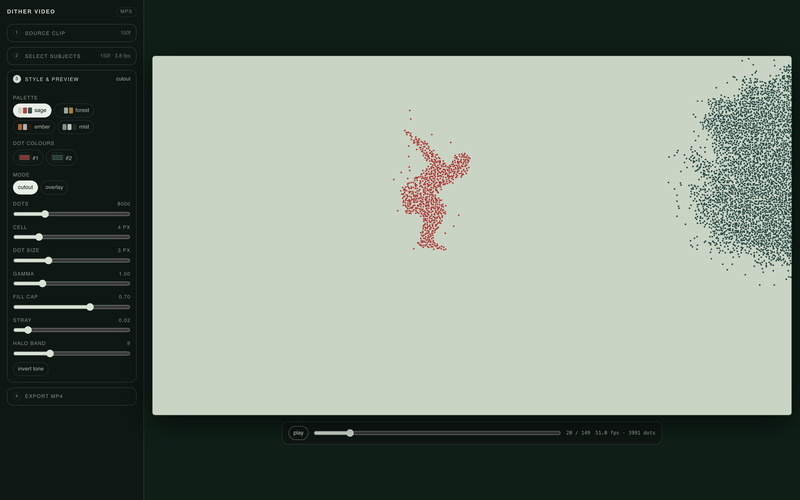

# Dither Video

A local, offline web tool that turns a short video clip into a **flicker-free dotted
dither animation**: you point at the subjects you want, EdgeTAM tracks them through
the clip, and a blue-noise threshold renderer paints them as coloured dot swarms on a
flat background.

Nothing is uploaded anywhere. Everything runs on this Mac (Apple Silicon / MPS).



---

## Run it

```bash
cd ~/dither-video
./run.sh
```

`run.sh` is idempotent:

1. `setup.sh` creates `env/venv` + clones `env/EdgeTAM` + fetches the checkpoint if
   they are missing (no-op afterwards).
2. Starts `server.py` on `http://127.0.0.1:8765`. If 8765 is already taken by
   something else it walks forward to the next free port and prints which one it
   used. Override with `DV_PORT=…`.
3. Opens the UI in your browser (`DV_NO_OPEN=1` skips that).

Stop it with Ctrl-C. Re-running while a server is up just re-opens the tab.

## How you use it

1. **Source clip** — drop an `.mp4` / `.mov`. It is decoded to `720p @ 30 fps`
   JPEG frames, capped at `max_seconds` (slider, default 10 s) and 300 frames.
2. **Select subjects** — scrub to any frame, then prompt each subject on that frame:
   * click → positive point
   * shift-click / alt-click → negative point
   * drag → box
   * `+ add subject` for another object (up to 6), each with its own colour and an
     `✕` to remove it.
   There is deliberately **no lasso** here: the video tracker only consumes points
   and boxes, and it re-derives the outline itself on every frame. Press **Track**.
   Progress shows live frames/second and finishes with e.g.
   `tracked 150 frames in 25.1 s (6.0 fps) on MPS · 1 subject`.
3. **Style & preview** — the clip plays back in a canvas with the dither applied
   **live in the browser**, using the same 64×64 blue-noise tile the exporter uses
   (`GET /api/bluenoise`) and the same per-cell hash, so the preview is the export.
   Palettes (sage / forest / ember / mist), per-subject dot colour, cutout vs
   overlay, and the dots / cell / dot-size / gamma / fill / stray / halo sliders all
   update the current frame instantly.
4. **Export MP4** — renders the same parameters server-side with numpy + ffmpeg
   (libx264, crf 18), then offers a download link and an inline player.

## Architecture

```
server.py          FastAPI on 127.0.0.1:8765
  POST /api/upload                    mp4/mov -> jobs/<id>/frames/%04d.jpg  (720p, 30 fps)
  GET  /api/jobs/<id>/meta
  GET  /api/jobs/<id>/frame/<n>       jpeg
  POST /api/jobs/<id>/track           {frame_idx, objects:[{id, points, box}]}
  GET  /api/jobs/<id>/status          {state, done_frames, n_frames, elapsed_s, fps, render:{…}}
  GET  /api/jobs/<id>/mask/<obj>/<n>  png (soft mask, sigmoid(logits)*255)
  POST /api/jobs/<id>/render          {subjects:[{id,dot}], mode, bg, n, cell, dotpx, …}
  GET  /api/jobs/<id>/out.mp4
  GET  /api/bluenoise                 the 64x64 threshold tile as JSON
  GET  /api/palettes                  palettes + renderer defaults + device
  GET  /                              static/index.html

render.py          the dither renderer (also a CLI):
                     python render.py --frames DIR --masks DIR[:#rrggbb] … --out out.mp4
static/            index.html + app.js + style.css, vanilla, no build step, no CDN
env/               venv + EdgeTAM checkout + checkpoint   (gitignored)
jobs/<id>/         source, frames/, masks/<obj>/, out.mp4 (gitignored)
docs/              verification screenshots + verify-report.json
verify.mjs         headless Playwright end-to-end check against a running server
```

### Tracking

One EdgeTAM video predictor is built lazily on first use and kept on MPS for the
process lifetime. A track request runs **once for all objects**: every subject is
registered with `add_new_points_or_box`, then `propagate_in_video` runs forward from
the prompt frame and — when the prompt frame is not frame 0 — **also backward**
(`reverse=True`), so a click on a middle frame still fills the whole clip. Masks are
written as soft 8-bit PNGs, one directory per object. Tracking happens on a
background thread; the UI polls `/status`.

Per-frame cost grows roughly linearly with the number of objects (see numbers below),
because EdgeTAM batches objects through the memory encoder.

### The dither

Ported from the reference renderer and extended to multiple masks. Key properties:

* **No error diffusion.** A single blue-noise tile (void-and-cluster-ish: iterated
  high-pass + histogram remap) is generated once and tiled over the cell grid, plus a
  fixed per-cell jitter. Dots therefore stay put between frames and only switch on and
  off as tone changes — that is what kills the flicker.
* **Per-cell weight** = block mean of `mask × tone`, where `tone = 1 − luminance`
  (or luminance when *invert* is on) raised to `gamma`.
* **Dot budget.** A binary search finds the gain that lights `min(n, fill × covered)`
  cells, so the subject never collapses into a solid silhouette.
* **Halo.** A fraction `stray` of extra dots is scattered in a `band`-wide ring
  around each subject.
* **Multi-subject ownership.** Each cell belongs to exactly one subject — whichever
  mask covers it most — so overlapping masks never double-paint or fight over colour.

`static/app.js` reimplements all of the above in JavaScript. The two places where the
original used `numpy.random` were replaced by a portable integer hash (`hash01`,
identical in `render.py` and `app.js`) so the browser can reproduce the exact same
jitter and stray fields.

## Verification

`verify.mjs` drives a real headless browser against a real server and a real EdgeTAM
run — no mocks. It uploads a clip, drags boxes and clicks points on the canvas, tracks,
samples the preview canvas' pixels, exports, and `ffprobe`s the result.

```bash
./run.sh &                      # or start server.py yourself
node verify.mjs http://127.0.0.1:8765 /path/to/clip.mp4
```

(Playwright is resolved from `~/node_modules`; `DV_CHANNEL=chrome` uses system Chrome.)

Results on this machine (M4 Pro, 24 GB, macOS 26.1, torch 2.13 / MPS), 150-frame
1280×720 30 fps clip:

| | 1 subject | 2 subjects |
|---|---|---|
| track | 150/150 frames, 25.1 s, **6.0 fps** | 150/150 frames, 39.3 s, **3.8 fps** |
| browser preview | 73 fps per frame | 50 fps per frame |
| MP4 export | 150 frames, 2.7 s (55 fps) | 150 frames, 3.9 s (38 fps) |
| `ffprobe` output | 1280×720, 30/1, 150 frames | 1280×720, 30/1, 150 frames |
| console / page errors | 0 | 0 |

Preview-vs-export parity, dual-subject frame 20: the browser lit **3991** cells, the
Python renderer lit **3992** (0.03 % apart; the one cell is a JPEG-decode borderline).

Prompting from a middle frame (frame 75, backward + forward propagation) produced all
150 masks in 21.5 s with a non-empty mask on frame 0.

## Limits

* **macOS + Apple Silicon.** Device is MPS by default (`DV_DEVICE=cpu` works but is
  far slower). No CUDA path is built (`SAM2_BUILD_CUDA=0`).
* **Short clips.** Frames are extracted at 720p/30 fps and capped at 300 frames /
  10 s by default. Longer clips mean linearly more tracking time and disk.
* **One track at a time.** A process-wide lock serialises EdgeTAM runs; a second
  track request while one is running gets `409`.
* **Objects cost time.** ~6 fps for one subject, ~3.8 fps for two on this machine.
  Six subjects on a 300-frame clip is several minutes.
* **Tracking quality is EdgeTAM's.** Fast motion, motion blur and occlusion can make
  a mask drift or bleed; the fix is a better prompt (add a negative point, or prompt
  on a cleaner frame), not a renderer setting. There is no per-frame mask correction.
* **Preview cost.** The preview does the full-resolution dither in JS on the main
  thread and caches at most 48 frames of decoded bitmaps. On a 1280×720 clip it runs
  at ~50–75 fps of compute for 1–2 subjects, but heavier settings (small `cell`, many
  subjects) will drop below the clip's own frame rate.
* **No audio, no morphing.** The export is video only. The image-demo's shape-morph
  is out of scope here.
* **Jobs are never garbage collected.** `jobs/` grows ~13 MB per 150-frame clip per
  subject set; delete directories by hand.
* **EdgeTAM patch.** `setup.sh` rewrites two `.view(...)` calls to `.reshape(...)` in
  `sam2/modeling/perceiver.py`; upstream throws
  *"view size is not compatible with input tensor's size and stride"* as soon as more
  than one object is tracked.
