# Dither Studio

### [**Open it → kcvete.github.io/dither-studio**](https://kcvete.github.io/dither-studio/)

[](LICENSE)
[](https://github.com/kcvete/dither-studio/actions/workflows/pages.yml)
[](https://github.com/kcvete/dither-studio/actions/workflows/ci.yml)
[](https://github.com/kcvete/dither-studio/releases/tag/models-v1)

Turn a photograph into computational structure. One unit, one palette, one logic,
repeated until the picture is made of it.

That idea is having a moment. When Solvd rebranded around it, the reason the
identity held together was not the look — it was that
[Afternow built them a dither tool](https://www.linkedin.com/posts/filip-justic_illustrations-no-one-drew-solvd-inc-builds-activity-7495381583588339712-qOF2),
so every new asset came out of the same machine instead of somebody's hand. A
brand system needs that. So does anyone who wants more than one image.

Dither Studio is that tool, in the open, and it goes one step further: it does
**video**, and it can dither **one thing** in it. Point at a person and EdgeTAM
follows them for the whole clip — they turn into dots and the background stays
where it is, or the other way round. Point at a person in a **photograph** and
the same model cuts them out on the spot, in about a tenth of a second, with no
propagation and no button: the outline is re-cut after every click. Drop a still
and take it no further and it is a still ditherer with fourteen error-diffusion
kernels and eighteen palettes.

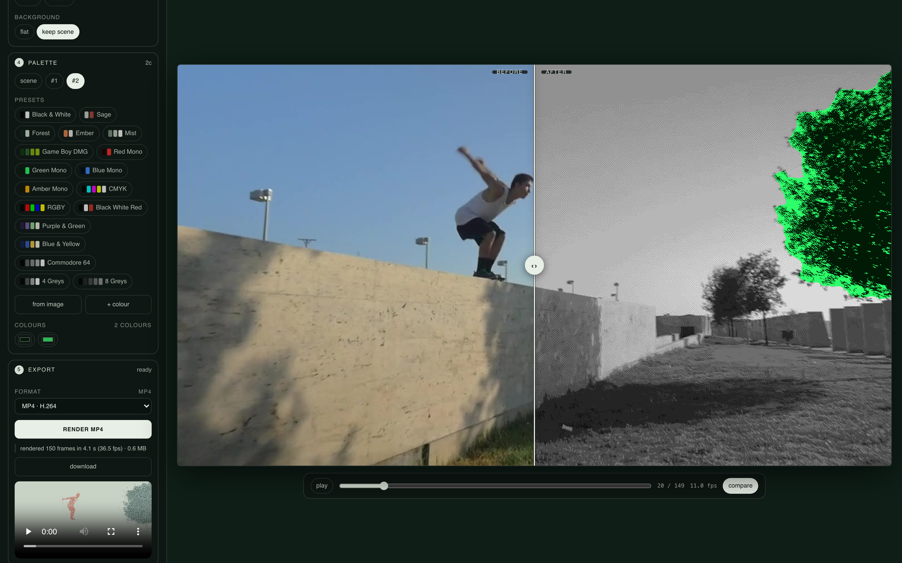

**It is free and it runs in your browser.** No account, no upload, no server —
the tracker, the dither engine and the video encoder are all in the tab. There
is also an optional local server that does the same work faster on an Apple
Silicon Mac, and the seam for a hosted one; the page picks whichever is there.

---

## Quickstart

Three ways in, in ascending order of effort. They are the same page.

### 1 · Use it — nothing to install

**[kcvete.github.io/dither-studio](https://kcvete.github.io/dither-studio/)**

That deployment is `web/` with the model weights baked in, and it is the whole
product: drop a clip or a still, point at a person, export. No account, no
upload, nothing leaves the tab. The first track downloads ~55 MB of weights once
and the browser caches them.

**Fastest in Chrome and Safari; Firefox works but is slower.** Tracking runs on
WebGPU, so a current Chrome, Edge or Safari 26 is the fast path; anything else
falls back to WASM and says so in the header. See
[Browsers](#browsers) for what was measured where.

Measured against that deployment, headless Chromium with WebGPU, nothing local
running: page to a live engine in **1.08 s**, `sample.mp4` decoded to 150 frames
in the tab, one click segmented the subject in **0.06 s**, 150 frames tracked in
**12.0 s (12.5 fps)** on WebGPU fp16, and the dithered clip rendered to VP9 WebM
in **5.1 s (29.3 fps)** — 150 frames out, 1.1 MB. Zero page errors, zero failed
requests, and exactly one console line: the `/api/meta` 404 from the engine
probe, which is the fallback working. Sixteen checks,
[`docs/live-pages-report.json`](docs/live-pages-report.json).

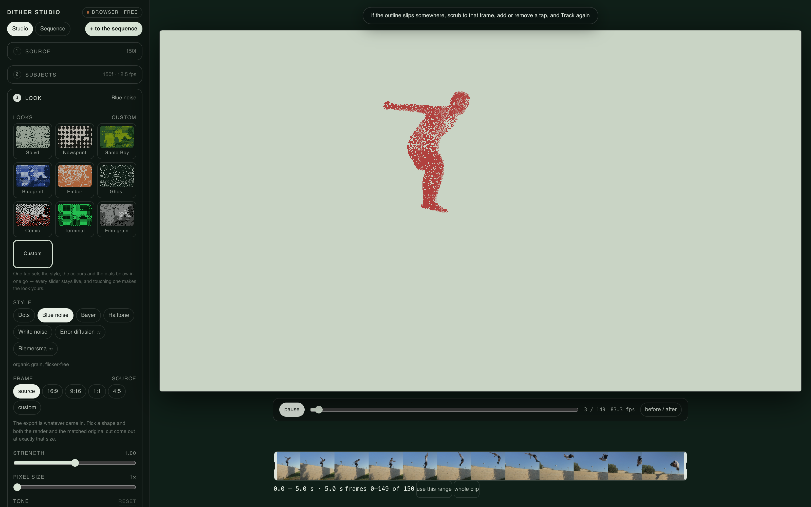

### 2 · Run it locally — about 2x faster

On an Apple Silicon Mac:

```sh
git clone https://github.com/kcvete/dither-studio.git
cd dither-studio
./run.sh
```

`run.sh` is idempotent. It calls `setup.sh` — creates `env/venv`, clones
`env/EdgeTAM`, fetches the checkpoint, compiles `env/libcdither.dylib`, exports
the CoreML graphs *and* the ONNX graphs, vendors onnxruntime-web — then starts
`server/server.py` on `http://127.0.0.1:8765` and opens the browser. First run is
a few minutes and about 330 MB on disk; every run after is a no-op. If 8765 is
taken it walks forward to the next free port and says which one. `DV_PORT=`
overrides, `DV_NO_OPEN=1` skips the browser.

What that buys: **20.9 fps** tracking against 12.4 in the tab, three tracker
resolutions instead of one, one batched pass for several subjects instead of one
pass each, and **H.264 MP4** out instead of WebM.

The page served by that server is the same directory. There is no fork.

### 3 · Host it yourself — the page, on your own domain

`web/` is self-contained: no build step, no bundler, nothing fetched from a CDN
at run time. Copy it to GitHub Pages, Cloudflare Pages, Netlify, S3, anything.

```sh
./setup.sh --page-only        # pulls the pre-exported weights + onnxruntime-web
python3 -m http.server -d web 8080
```

`--page-only` needs no python environment, no PyTorch and no checkpoint: it
downloads the graphs from the [`models-v1`](https://github.com/kcvete/dither-studio/releases/tag/models-v1)
release. Skip it entirely and the page still does stills and whole-frame clips —
it says plainly in step 2 that subject tracking has no weights, instead of
failing on the Track button. See [`web/README.md`](web/README.md), and
[`.github/workflows/pages.yml`](.github/workflows/pages.yml) for how this repo's
own deployment is built.

Verified on exactly that: `python3 -m http.server -d web`, no server anywhere,
page up in 0.6 s, 149 frames tracked at 9.6 fps and exported to WebM in 5.3 s.

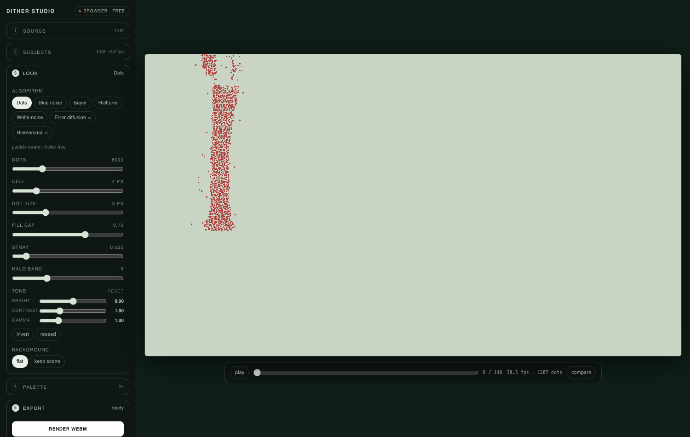

### Knobs on setup.sh

| | |
|---|---|
| `./setup.sh --page-only` | the static page only: weights from the release + onnxruntime-web. No venv, no PyTorch, no checkpoint |
| `DV_MODELS=download ./setup.sh` | full install, but download the ONNX graphs instead of spending 90 s exporting them |
| `DV_SKIP_WEB_MODELS=1 ./setup.sh` | server only: no ONNX graphs, no `web/ort` |
| `DV_EDGETAM_CKPT=<path>` | reuse an `edgetam.pt` you already have |
| `DV_PYTHON=<path>` | which python builds the venv (default 3.13) |

## Three tiers, one codebase

| | **Browser** | **Local server** | **Hosted** |
|---|---|---|---|
| what it is | `web/`, on any static host | `server/`, on your machine | `server/`, on a rented GPU |
| price | free | free | yours to set |
| tracking | 12.4 fps | 20.9 fps | ~150 fps on an A100 |
| your frames | never leave the tab | never leave the machine | uploaded |
| video out | WebM (VP9) | H.264 MP4 | H.264 MP4 |
| status | shipped | shipped | the seam is here, the billing is not |

The third column is a deployment, not a feature branch: the same `server.py`, on
a CUDA box, with `DV_API_KEY` set. See *Hosting a paid backend* below.

## Architecture

```
                    ┌──────────────────────── web/ ───────────────────────────┐
                    │  index.html · app.js · style.css                        │
   a file  ────────▶│                                                         │
                    │  engines/index.js ── GET /api/meta, 1.5 s timeout       │
                    │        │                                                │
                    │        ├── server answered? ──▶ engines/remote.js ──────┼──▶ ┌─── server/ ────┐
                    │        │                        {baseUrl, apiKey?}      │    │ server.py      │
                    │        │                                                │    │  ├ ffmpeg      │
                    │        └── nothing there?   ──▶ engines/browser.js      │    │  ├ EdgeTAM     │
                    │                                  │                      │    │  │  └ coreml/  │
                    │                                  ├ <video> ▶ canvas     │    │  ├ dither.py   │
                    │                                  ├ track.js ▶ models/   │    │  │  └ cdither.c│
                    │                                  │   (onnxruntime-web,  │    │  └ render.py   │
                    │                                  │    WebGPU)           │    │     └ ffmpeg   │
                    │                                  └ MediaRecorder ▶ WebM │    └────────────────┘
                    │                                                         │
                    │  dither.js ◀── the preview, and the browser export ──────┤
                    └─────────────────────────────────────────────────────────┘
                                          ▲                                          ▲
                                          └───────── same algorithm, byte for byte ──┘
                                                     (server/parity.py is the gate)
```

```
web/            the deployable page. engines/, dither.js, canvas.js, polish.js,
                track.js, player/, models/
server/         the optional accelerator. FastAPI + numpy + the C dither loop
coreml/         EdgeTAM -> CoreML: traceable wrappers, exporter, live-swap accel
onnxexport/     EdgeTAM -> ONNX: the five graphs the browser engine runs
bench/          tracking benchmarks, stage profiler, the resolution A/B
verify.mjs      headless end-to-end check, server engine
verify-web.mjs  headless end-to-end check, browser engine + the engine seam
env/            venv, EdgeTAM checkout, checkpoint, libcdither, CoreML  (ignored)
jobs/<id>/      source, frames/, masks/<obj>/, polish/, out.mp4        (ignored)
                a still is the same thing with one frame in it and no source
                swept by server/jobsgc.py: 2 GB / 14 days, 48 h grace
docs/           verification screenshots, reports, the tracking test clip
```

## Which engine am I on?

A chip in the header always says, and always switches:

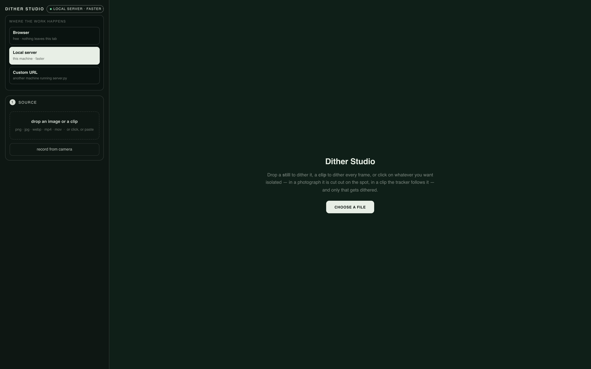

On load the page does one thing: `GET /api/meta` against its own origin with a
1.5 second timeout. An answer means a Dither Studio server is there, and it wins,
because on the machine that has one it is faster. Anything else — 404, timeout,
CORS, a page sitting on GitHub Pages — and everything runs in the tab. A choice
you make by hand is remembered and beats the probe.

**Browser · free** · **Local server** · **Custom URL** (with an optional API key,
for a backend you are paying for). Switching engines drops the loaded clip,
because the frames live inside whichever engine decoded them; the page says so
rather than silently re-uploading.

## What you can do

The page has two views, and the header switches between them:

* **Studio** — drop **an image** or **a clip** (or paste one), point at what you
  want isolated, choose a look and a palette, export. The steps adapt to what you
  gave it and to which engine is live. Everything below, up to *Export*.
* **Sequence** — a strip of dot clouds with a transition between each pair. It
  draws on everything the studio has produced this session and outlives any one
  clip. See [Sequences](#sequences).

### 1 · Source
Images stay in the tab on either engine — they are never uploaded. Clips are
decoded to 720p / 30 fps: in the browser engine by a `<video>` seek loop into
JPEG blobs, on the server by ffmpeg into `jobs/<id>/frames/`. Both produce the
same frame grid, so frame 42 is the same picture either way.

**There is no length cap.** There used to be one — 10 s, 300 frames, a *max
length* slider — and it is gone on both engines. What replaced it is
[informed consent](#length-consent-not-caps): the page does the arithmetic out
loud before anything is decoded, and then does what you asked.

**Record from camera** opens `getUserMedia` (1280×720 if the camera has it) with
a live preview on the stage and two buttons:

* **photo** grabs the frame on screen at the camera's own resolution and hands it
  to the still flow as a PNG — dither look, palette, PNG export, all client-side,
  exactly as if you had dropped an image.
* **record** runs `MediaRecorder` with a five-minute stop and a running clock
  — a sanity stop so a forgotten recording cannot fill the disk with an
  8 Mbit/s WebM, not a length limit; the label says so. What
  comes out is a WebM blob that goes down exactly the same path a dropped file
  does — the browser engine decodes it, the server engine uploads it — so a
  camera clip is a clip, with nothing special downstream of the recorder.

Either one closes the camera afterwards; the button reopens it.

**Trim** appears under the drop zone after any clip, recorded or dropped: twelve
thumbnails, two draggable handles, a duration readout and *use this range*. The
range is not a crop of an already-decoded clip; it re-opens the source over those
seconds, so only that part is ever decoded:

* **browser** — the seek loop starts at `trimStart` and runs to `trimEnd`, or to
  the end of the clip when nothing is trimmed.
* **server** — `-ss` before `-i` and `-t` after it, i.e. ffmpeg seeks rather than
  decoding and discarding.

The trim is the whole story now that nothing is capped: a 2 s window out of a
30 s clip is 2 s of frames, and a 25 s window out of it is 25 s of frames.
Measured in `verify.mjs`: whole clip 150 frames, a 2 s trim 60 frames, a trim
that runs off the end clamped to the 30 frames that are there, the same 5 s clip
looped to 30 s arriving as all **900** frames, and the trimmed clip's frame 0
byte-for-byte the frame ffmpeg gives for `-ss 2.0` (mean abs diff 0.000).

**Changing your mind is free.** Trimming again *before* anything is tracked does
not re-upload the clip and does not ask for the file a second time. The server
keeps `jobs/<id>/source.mp4`, so *use this range* is one
`POST /api/jobs/<id>/reextract` — a fresh job hard-linked to the same source
bytes, no second copy on disk. The browser engine keeps the `File` handle and
re-decodes from it. Measured: cutting 30–45 s out of a 90 s clip already on the
server took **0.5 s end to end** through the UI, produced 450 frames, and its
frame 0 is byte-identical to `ffmpeg -ss 30` (mean abs diff 0.000). The status
line says *re-cut, nothing re-uploaded*.

<a id="trimming-after-the-track"></a>
#### Trimming after the track: a window, not a second track

Re-extracting is the right answer *before* a track — tracking frames you are
going to throw away is wasted time. After a track it is the wrong one, because
it throws the masks away with the frames. So once a clip is tracked, the trim
bar means something different.

The frames of a clip live in `jobs/<id>/frames/` and the tracker writes one mask
file per frame per subject beside them in `jobs/<id>/masks/<obj>/`. Both are
numbered from 0, and neither moves. A narrower range is therefore a **window**
on what is already there:

* **narrower than the tracked clip** — the trim bar sets an in/out pair of frame
  indices and nothing else happens. No ffmpeg, no upload, no propagation. The
  transport says `frames 15–44 of 60` with a *full clip ↺* beside it, and the
  preview plays that range.
* **wider than the tracked clip** — nothing is silently re-cut. The panel names
  the frames that do not exist yet (*frames 60–119 aren't tracked yet…*), states
  what getting them costs, and waits for one of two buttons.

Everything downstream reads that window: the preview, the render, all five
export containers, the matched original cut, `.dots.gz`, and the in/out that
*add to the sequence* seeds a strip entry with (the pool item still holds every
tracked frame, so the entry can be widened again in the inspector).

On the wire it is two integers. `POST /api/jobs/<id>/render`,
`/original` and `/dots` all take `frame_in` and `frame_out`, inclusive, indices
into the frames directory; omitting them means the whole clip, so a client that
never heard of them behaves exactly as before. `GET /api/meta` advertises
`"frame_range": true`. `server/render.py:frame_range()` slices the file list and
hands the renderers the offset the masks have to be read at — frame *k* of the
output is `frames/(in+k).jpg` and `masks/<obj>/(in+k).png`. The browser engine
walks the same absolute indices over the blobs and mask logits it already holds.

Measured in `verify.mjs` (flow **R**) and `verify-web.mjs` (**W2c**), a tracked
60-frame clip narrowed to 0.5–1.5 s:

| | server engine | browser engine |
|---|---|---|
| requests fired by the narrowing | one frame + one mask (the preview redraw) — **no** `/track`, `/reextract` or `/upload` | **none at all** |
| job id / frames on disk | unchanged | unchanged |
| render | 30 frames | 30 frames |
| matched original cut | 30 frames, same w/h/rate as the render | 30 frames, same w/h as the render |
| cut frame 0 vs `frames/0015.jpg` | mean abs diff **0.647** | **3.035** vs the tab's frame 15 (VP9) |
| cut frame 0 vs `frames/0000.jpg` (control) | **19.99** — it is not frame 0 | **20.52** |
| `.dots.gz` | 30 frames, byte-identical to frames 15–44 of the whole clip's document | 30 frames |
| strip entry seeded by *add to the sequence* | in 15, out 44, 30 frames long, pool item still 60 | same |

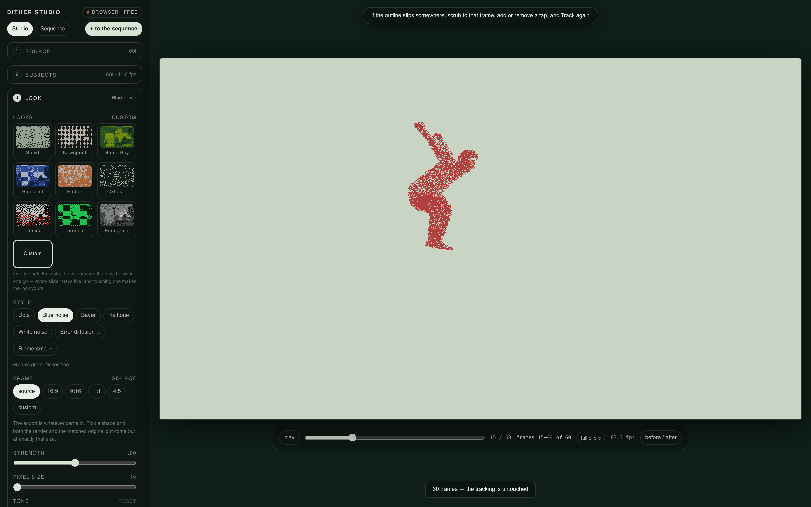

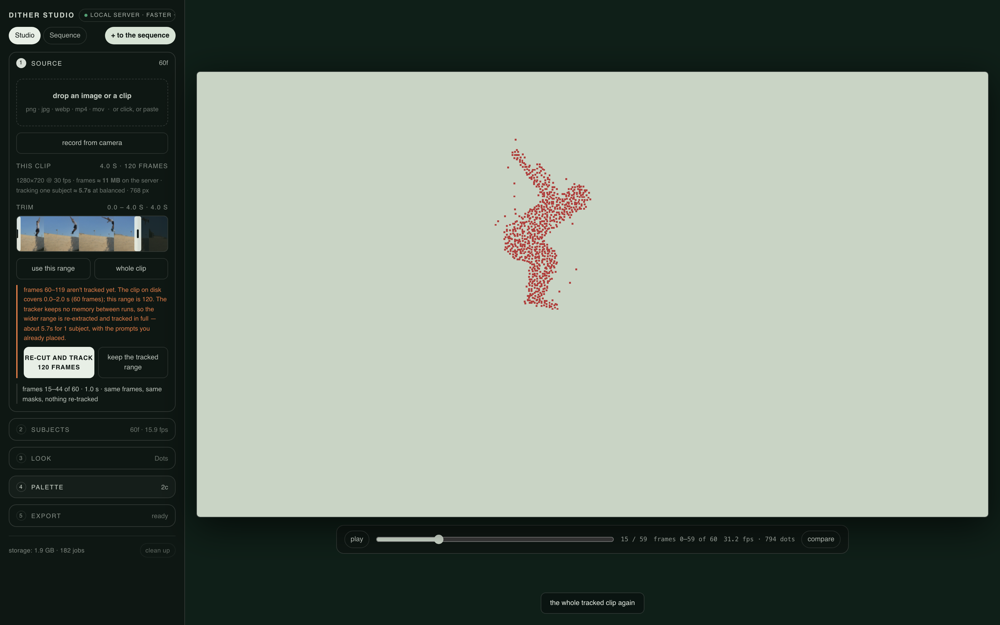

**What the extend actually does — say it plainly.** Taking the offer re-extracts
the wider range and tracks it **in full**, carrying the prompts you already
placed across (their frame numbers shift by however much the range's start
moved). It does *not* propagate only the missing tail out of the existing memory
bank, because there is no memory bank left to propagate from: EdgeTAM's
inference state is built by `predictor.init_state()` over the whole frames
directory at the start of every `/track` and torn down at the end of it
(`server/server.py`, `_track_worker`), and the browser engine's tracker is reset
the same way. Keeping one alive across requests is a different piece of work.
The panel says the number rather than implying the cheap thing happened —
measured: 60 → 120 frames re-extracted and re-tracked in **8.0 s** on the server
engine, **12.8 s** in the tab, one subject.

<a id="length-consent-not-caps"></a>
#### Length: consent, not caps

Nothing is refused for being long. Instead, the moment a clip's header is read —
before a single frame is decoded — the panel under the drop zone states what it
is about to cost:

* the range in seconds and in **frames**
* the decoded resolution and what those frames **weigh** (on the server's disk,
  or in this tab)
* how long **tracking one subject** takes at the tracking quality that is
  currently selected — frames ÷ that quality's measured fps

Over **60 s** a gentle line appears — *long clip: tracking ≈ 2m 9s — consider
trimming. You can also trim afterwards, and re-cut without uploading again* —
and the clip waits for a click instead of committing the tab to a long decode.
It is a sentence, not a wall: *whole clip* is right there next to *use this
range*, and it takes all of it.

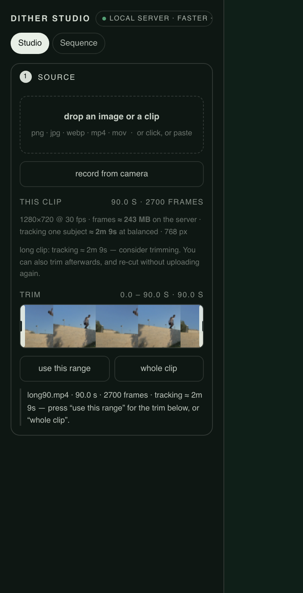

The same 90 s clip on the browser engine says *≈ 789 MB in this tab* and
*≈ 3m 38s* instead — `docs/w-long-estimate-browser.png`. Same panel, the
engine's own arithmetic.

The other two guardrails are the same shape — a number and a suggestion, never a
ceiling:

* **browser engine, over ~2 GB estimated in-tab** (frames + the 40-frame bitmap
  cache + one 192×192 float mask per frame per subject) — *it will work, but the
  local server engine keeps them on disk instead. Switch engines, or trim.*
* **server, not enough free disk** — the upload is refused **before** ffmpeg
  starts, with `507` and the two numbers: how many GB those frames need and how
  many are free. Better to say it than to fill the volume.

Because the extraction of a long clip is one long POST, the page polls
`GET /api/extract/<ticket>` beside it and shows ffmpeg's own frame counter, so a
90 s clip is visibly moving rather than apparently hung.

##### What a 90 s clip actually costs

The 5 s `sample.mp4` looped to 90 s — 2,700 frames at 1280×720 — measured on an
M-series laptop, CoreML backend:

| | server engine | browser engine |
|---|---|---|
| open it (upload + decode, through the UI) | **2.8 s** | **16.5 s** (was 344 s) |
| all 2,700 frames arrived | yes | yes |
| frames kept | 137 MB on disk, 51 KB/frame | 290 MB of JPEG blobs in the tab |
| JS heap after the decode | — | 11 MB (the blobs are not on the heap) |
| track 1 subject @ 512 px | **149 s = 2.5 min**, 18.1 fps | not run |
| peak process memory while tracking | **4.3 GB** RSS | — |
| masks written | 2,700 PNGs, 23.8 MB | — |
| re-cut 30–45 s afterwards | **0.5 s**, no upload | **64 s**, re-decoded from the `File`, no re-pick |
| console errors | 0 | 0 |

The first row used to read *344 s = 5.7 min*, and it is the reason
`web/engines/decode.js` exists. The tab paid for 2,700 individual `<video>`
seeks, each of which re-primes the decoder and walks back to a keyframe; it now
demuxes the file itself and runs one `VideoDecoder` over the stream in a module
Worker, which is the pass ffmpeg was already doing. Same frames — byte-identical
JPEGs, checked both ways in `verify-web.mjs` — about a tenth of the time, and
none of it on the main thread. See [Decoding](#decoding) for the measurements.
Both engines got there either way; `docs/w-long-loaded-browser.png` is the tab
afterwards, scrubber reading *0 / 2699*, on the free engine with no server
involved.

The estimate the panel showed for that clip was *≈ 243 MB on the server ·
tracking one subject ≈ 2m 9s at balanced · 768 px* (and *≈ 789 MB in this tab ·
≈ 3m 38s* on the browser engine). The disk figure is deliberately conservative —
it assumes 90 KB per 720p JPEG and the real clip came in at 51 KB — and the time
figure comes from `TRACK_SIZES`, which is a median on the reference clip, not a
promise. See [Estimates are estimates](#estimates-are-estimates).

The two guardrails, fired for real:

* the same clip looped to **5 minutes** (9,000 frames) on the browser engine —
  *≈ 2.3 GB of frames and masks in this tab — it will work, but the local server
  engine keeps them on disk instead. Switch engines, or trim.*
  (`docs/w-long-estimate-5min.png`)
* a **40-minute** clip (72,000 frames) posted to a server with 3.6 GB free —
  `507 not enough disk for 72000 frames: 8.2 GB needed, 3.6 GB free. Trim the
  clip, or free some space.` No frames were written.

A camera recording has one wrinkle worth knowing: `MediaRecorder` WebM carries no
duration in its header until it has been seeked past its end, so both the
filmstrip and the browser decoder ask for it that way before deciding how many
frames there are. It is also the file the old seek loop was worst on — no Cues
either, so every seek was a scan — and correspondingly the file the WebCodecs
path helps most: **16.0 s → 1.26 s** for 149 frames of VP8.

### 2 · Subjects
Two choices, and they read differently depending on what you dropped:

* **whole image / whole clip** — every pixel gets dithered. This is the default
  and the step can be skipped entirely.
* **select subjects / track subjects** — prompt what you care about.

#### A photograph: selected, not tracked

A still has one frame, so there is nothing to propagate through. Selecting a
subject in it is exactly the conditioning step the clip flow runs on frame 0,
with nothing after it: one image encode and the SAM heads, **~0.1 s**. That is
fast enough that there is no Track button and no progress bar — the mask is
re-cut after every click, box or drawn shape, and the tinted outline on the
photograph follows it live.

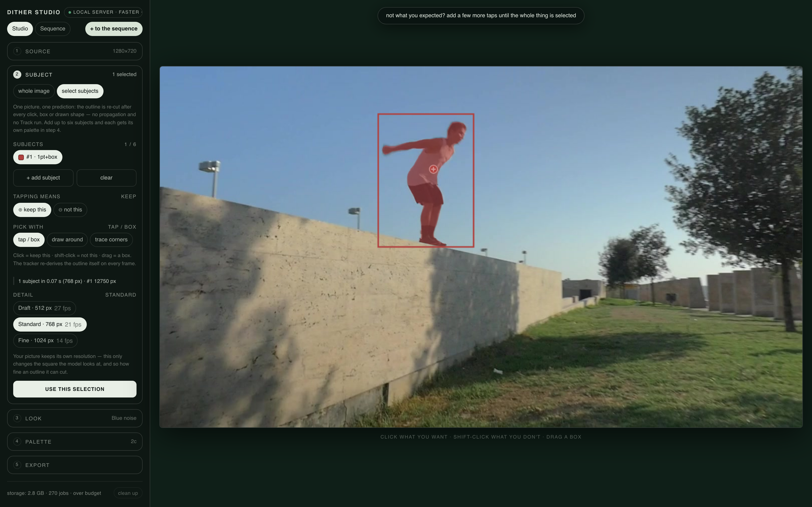

Everything else is the clip flow's, unchanged: the same *point / box*, *lasso*
and *polygon* tools, shift for a negative prompt, up to **six subjects**, one
palette each. What runs it:

| | how the still is segmented |
|---|---|
| **browser** | the photograph becomes a clip of one frame; `encoder` → `heads_prompt` (or `heads_mask` for a drawn shape). Nothing is uploaded. |
| **server** | `POST /api/upload_image` once — a job whose `n_frames` is 1 — then one `POST /api/jobs/<id>/preview` per click. The picture goes up once; the clicks do not re-upload it. |

The page sends the picture already scaled to the size it prompts at (longest
edge 1600), so clicks, masks and the overlay share one coordinate space on both
engines. The PNG still exports at the file's own resolution.

Then step 3 gets the split a tracked clip gets — **flat** background or **keep
scene** — and step 5 gets a *transparent background* checkbox.

| | |
|---|---|
| 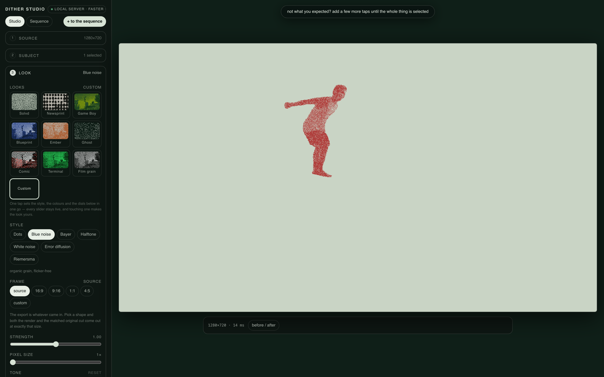 | 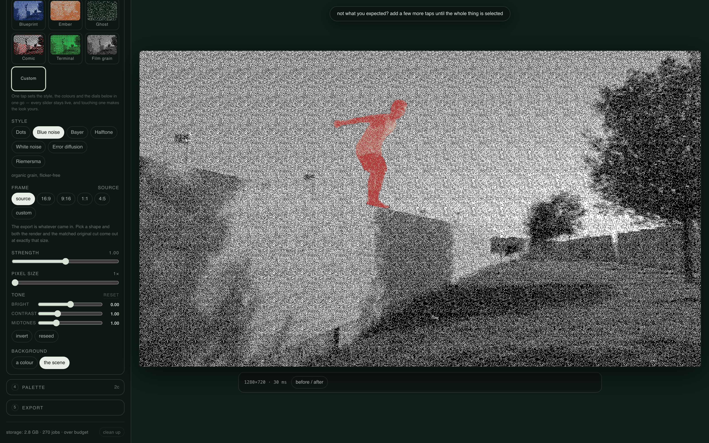 |
| **flat** — the subject dithered on a flat colour, everything else gone | **keep scene** — the photograph kept, the subject dithered into it |

#### A clip: tracked

* **track subjects** — scrub to any frame and prompt what you care about:
  click = keep this, shift-click = not this, drag = a box. `+ add subject` for
  another object (up to 6), each with its own palette. Press **Track** and
  EdgeTAM follows them forward *and* backward through the clip.

  **Each subject remembers its own frame.** A ball that flies into shot at frame
  80 does not exist on frame 0, so it cannot be prompted there. Scrub to where it
  appears, add a subject, and click it: the chip reads `#2 · 1pt+box @ 80`, and
  that is the frame that subject is conditioned on. Marks are drawn only on their
  own frame; a subject that lives elsewhere is dimmed, with a
  *"#1 prompted @ 0 — jump"* line that takes you back to it. Before its subject
  arrives, a mask is legitimately **empty** — no dots, nothing to erase, no
  lingering ghost. That is the right answer about a ball that is not in the shot.

  

  **Prompt tool** — *point / box*, *lasso* or *polygon*. Clicks and a box are the
  fast path and the one the tracker likes best: it re-derives the outline itself
  on every frame. When that is not enough, draw the subject instead — freehand
  with the lasso, corner by corner with the polygon, shift to subtract a shape.
  The drawing is rasterised to a binary mask and sent as a **mask prompt**, on
  both engines: the browser one has a fifth ONNX graph (`heads_mask`) for exactly
  this, because EdgeTAM's mask path skips the memory attention entirely rather
  than sharing the click path.

  A subject uses one or the other, never both: EdgeTAM's `add_new_mask` drops the
  frame's point inputs and `add_new_points_or_box` drops its mask, so a subject
  with a drawn shape ignores its clicks. The chip says which it has.

  **Preview this frame** runs only the first-frame prediction — no propagation —
  and paints the mask the tracker would produce over your prompt. **0.13 s** on
  the server, **0.14 s** in the browser once the graphs are warm. It answers "is
  this click enough?" before you spend the whole clip on it. It covers only the
  subjects prompted on the frame you are looking at.

  **Tracking quality** — *fast (512) / balanced (768) / best (1024)*, with the
  measured fps on each chip — is the square EdgeTAM resizes every frame to. Your
  clip keeps its own resolution either way. The browser engine offers **768
  only**, because that is the one resolution it ships models for; exporting all
  three would triple an 83 MB download for a knob that mostly matters when you
  are waiting on a server.

### 3 · Look
Seven algorithms, each labelled with how it behaves on video:

| | | stability |
|---|---|---|
| **Dots** | the particle swarm — density follows tone, dots hold their position | flicker-free |
| **Blue noise** | organic grain from a void-and-cluster tile | flicker-free |
| **Bayer** | ordered crosshatch, 2×2 / 4×4 / 8×8 / 16×16 | flicker-free |
| **Halftone** | 45° rotated clustered-dot newsprint screen, same matrix sizes | flicker-free |
| **White noise** | raw hashed grain | flicker-free |
| **Error diffusion** | 14 kernels, optional serpentine — the sharpest detail | **flickers on video** |
| **Riemersma** | Hilbert-curve error diffusion, no directional bias | **flickers on video** |

The error-diffusion kernels are Floyd–Steinberg, False Floyd–Steinberg,
Jarvis–Judice–Ninke, Stucki, Atkinson, Burkes, Sierra 3, Sierra 2, Sierra 2-4A,
Fan 93, Shiau–Fan, Shiau–Fan 2, Stevenson–Arce and Simple 2D.

The flicker labels are the honest part: threshold modes reuse one fixed field
every frame, so dots stay put and only switch on and off as tone changes. Error
diffusion recomputes a chaotic error field per frame, so it boils. Both are
offered; the chip carries a `≈` marker on video so you know which you picked.

**Dots needs something to measure density inside.** On a clip that has to be a
tracked subject — there is nothing to hold the dots still against otherwise, and
the chip stays greyed until you have one. **On a still it does not**: with no
subject selected the whole picture is the mask and density comes straight from
luminance, which is what this renderer was written for in the first place. With
a subject selected, only the subject becomes dots.

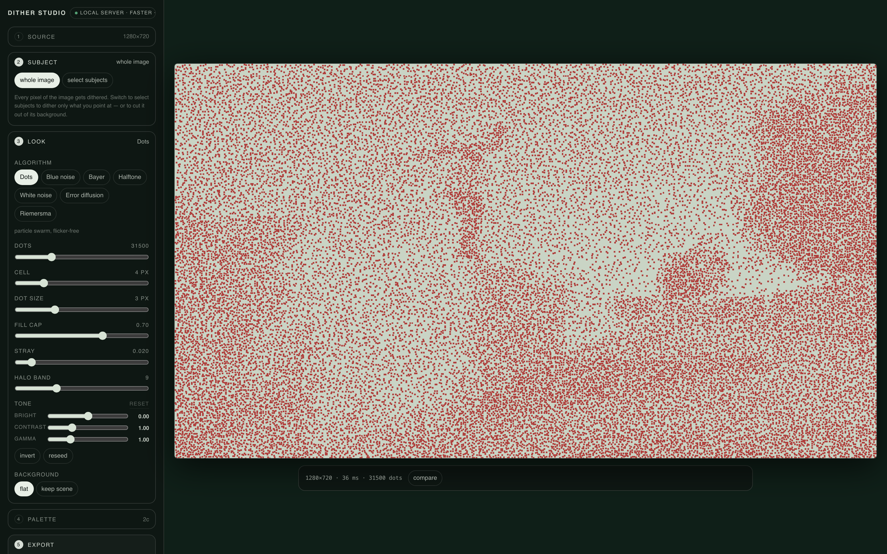

Choosing dots on a still with nothing selected adjusts two defaults once, and
then leaves both sliders alone:

* the **palette** becomes the pairing a subject would get (sage / red), because
  black-and-white is right for a dither that covers every pixel and wrong for
  dots, which paint *on* a background — white dots on the default sage are
  invisible;
* the **dot count** is aimed at 55 % of the cells rather than the subject-sized
  8,000. A 720p frame at cell 4 is 57,600 cells, and 8,000 of them lit is a
  scatter with no picture in it; the tree and the wall only come out of the noise
  somewhere north of half.

One thing to know: the dots grid is measured in **output pixels**, exactly as
*pixel size* is. The preview runs at up to 1600 px on the long edge and the PNG
at the file's own resolution, so a picture bigger than that exports a finer grid
than the preview draws. Every camera photo and most uploads are at or under
1600 px, where preview and export are the same picture.

Also here: dither strength, pixel size (chunky-pixel scale, box-downsample then
nearest-upscale), brightness / contrast / gamma / invert, and **reseed** for a
new noise field. *Background* — flat colour or the dithered scene — appears
wherever part of the picture is left alone: a tracked clip, a selected subject,
or the dots look on a still.

#### Mask polish

A tracker's masks are good outlines and restless neighbours: the edge moves a
pixel or two between frames, pinholes open and close inside a body, and a
subject standing still shimmers. Averaging a few frames of the *soft* mask
together fixes all of it — and ruins anything fast, because averaging a struck
ball over five frames **is** a streak. The first version of this smeared Roberto
Carlos's free kick into a comet.

So the window is not fixed. Per subject, per frame, polish measures how far the
mask's centroid walked against how big the mask is — displacement over
`sqrt(area)` — and closes the temporal window as that ratio grows:

* **temporal** — weighted mean of the soft masks in the window. The weight is
  triangular in distance and multiplied by a motion gate that reaches zero once
  the cumulative centroid walk passes `0.35 × sqrt(area)`. No threshold to tune,
  no subject to label by hand: a body drifting three pixels a frame gets the
  whole window, a ball crossing thirty gets none of it.
* **morph** — grayscale close, then open, square element. Closes the pinholes
  inside a body and drops the specks outside it.
* **blur** — one or two passes of a separable `[1 2 1]/4`, to take the stair
  stepping off the 192×192 mask upsample.

One 0–100 **strength** per subject sets all three, and it is **off by default**:
polish is a decision about a subject, not a global improvement. Video only — a
still has no neighbouring frames.

| strength | frames each side | close/open radius | blur passes |
|---|---|---|---|
| 0 (default) | 0 | 0 | 0 |
| 30 | 1 | 1 | 1 |
| 70 | 2 | 1 | 1 |
| 100 | 3 | 2 | 2 |

Measured on the Roberto Carlos free kick — 189 frames of 1997 broadcast, four
subjects tracked, ball 37 px across and travelling 796 × 341 px across the
frame — at strength 70, against the same filter with the motion gate removed:

| ball (#12), soft-mask geometry | tracker | polish 70 | no motion gate |
|---|---|---|---|
| elongation, p90 | 2.21 | **2.12** | 3.39 |
| major axis, p90 | 70.8 px | **66.8 px** | 122.9 px |
| mass landing off-subject, p90 | 0.069 | **0.089** | 0.365 (max 0.71) |

| bodies, frame-to-frame mask churn | tracker | polish 70 | no motion gate |
|---|---|---|---|
| #9 | 0.119 | **0.072** | 0.137 |
| #10 (the striker) | 0.093 | **0.064** | 0.088 |
| #13 | 0.242 | **0.163** | 0.174 |

Churn is the symmetric difference between consecutive binarised masks over their
mean area — the shimmer, as a number. Polish takes a third off it. The naive
filter is *worse* than doing nothing on two of the three bodies, because this
clip is a 25→30 fps broadcast conversion: the camera pans in jumps, and
averaging across a jump moves the mask instead of steadying it. The motion gate
sees those jumps too.

The gate is legible rather than magic. For a 140 px body drifting 3 px a frame
the five weights come out `0.29 / 0.63 / 1 / 0.63 / 0.29`; for a 36 px ball
crossing 30 px a frame they come out `0 / 0 / 1 / 0 / 0` — the frame is left
exactly as the tracker drew it.

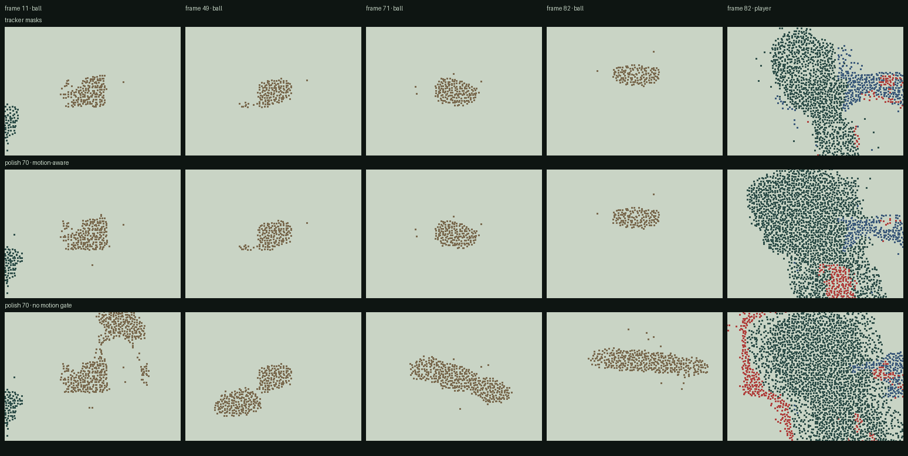

Same clip, same look, three rows: the tracker's masks, polish 70, and polish 70
with the motion gate removed. Four ball-in-flight frames and one of the striker.

Both engines implement it: `server/polish.py` in numpy on the mask PNGs,
`web/polish.js` in the tab on the mask bitmaps, and the two are the same
arithmetic to the last float — `server/parity.py` gates them (see
[Verification](#verification)). The server caches its polished masks per
(subject, strength) under `jobs/<id>/polish/`, so the first render at a strength
pays for it and every later one does not: 8 s a subject to build, 38.2 s → 8.3 s
wall clock for the same 189-frame MP4 the second time. In the tab the first
polished draw of a frame costs 50–100 ms; after that the cache makes drawing
*faster* than not polishing (12.3 ms against 23 ms a frame), because a cached
polished mask skips the per-draw bitmap decode as well.

### Canvas — the shape it comes out
Everything above renders at the size of what came in. **Canvas**, at the bottom
of the Look step, is the other half of that sentence: pick a shape and the
export, the matched original cut and the `.dots.gz` all come out at exactly
those pixels.

| | pixels | |
|---|---|---|
| **source** | whatever came in | the default — every line below is inert |
| **16:9** | 1920×1080 | landscape |
| **9:16** | 1080×1920 | TikTok · Reels · Shorts |
| **1:1** | 1080×1080 | square |
| **4:5** | 1080×1350 | feed portrait |
| **custom** | any W×H | rounded to even, because no H.264 encoder takes an odd dimension |

It is one affine map — `web/canvas.js`: arithmetic, no DOM, no engine —
applied in one place:

```
X = (x - cx) · k + w/2          k  = cover scale × your zoom
Y = (y - cy) · k + h/2          cx = where the crop is centred
```

What that map *means* depends on what is on screen, and the tool picks without
asking:

* **cutout** (dots or a per-pixel look on a flat background) — there is nothing
  behind the subject to run out of, so the crop is not clamped to the source and
  the dots are **re-measured on the canvas itself**. A 9:16 cutout is 1080×1920
  of real dots at the dot size you chose, in *output* pixels; nothing is scaled
  up. The subject can sit dead centre wherever it happens to be in frame.
* **keep scene / whole frame** — real footage is visible, so this is an
  **auto-reframe**: a crop window of the target aspect, the largest that fits
  inside the source, clamped to its edges and following the tracked subject. No
  zoom by default.

**Framing** is `auto` · `follow` · `hold still`. Auto answers itself, and
answers it against the crop that is set rather than once and for all: if the
subject's whole-clip box fits inside a fixed window of that shape, the frame
holds still and the subject moves inside it; if it does not, the frame follows.
A 720p clip cropped to 9:16 follows where the same clip cropped to 1:1 holds
still: the 9:16 window is 405 px of the source's 1280, and the 1:1 one is 720.

The path itself is a mask centroid per frame, **smoothed with a gaussian over
±15 frames** — half a second either side at 30 fps — which is what turns a
jittery per-frame centroid into a camera move. Frames where the subject is not
in shot are filled from their neighbours rather than dragging the crop home and
back. On the server the centroids come from one request
(`GET /api/jobs/<id>/centroids`, every frame in one numpy pass); in the tab the
same walk happens over the mask logits already in memory.

**Drag the picture** on a paused frame to bias it. The nudge is stored as a
fraction of the source and *added* to the smoothed path, so a followed subject
stays followed, just off to one side; **recentre** undoes it. **Scale** zooms in
(or, below 1, out — which letterboxes honestly rather than inventing footage).

The preview is the canvas, at its real pixels: `#vcv` becomes 1080×1920 and the
stage letterboxes around it. What plays is what the file contains.

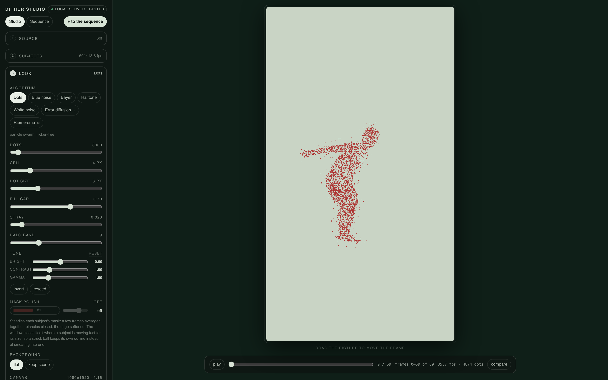

Three frames of each 9:16 export the verification run writes — the cutout, with
its dots measured on the 1080×1920 canvas, and the auto-reframed overlay beside
the matched original cut it is frame-for-frame with:

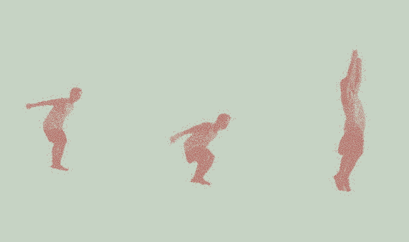
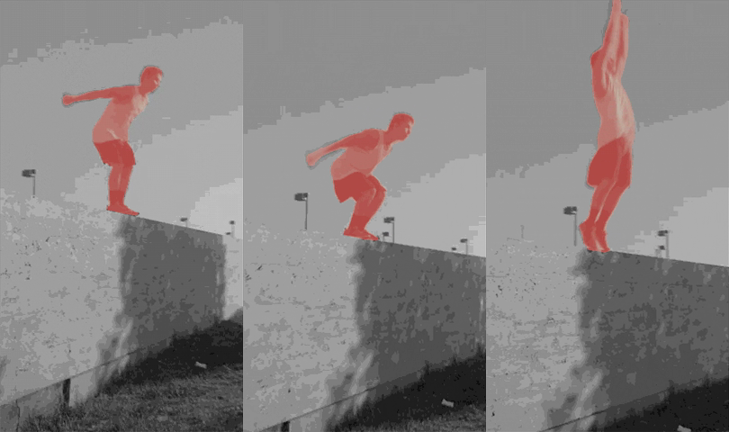
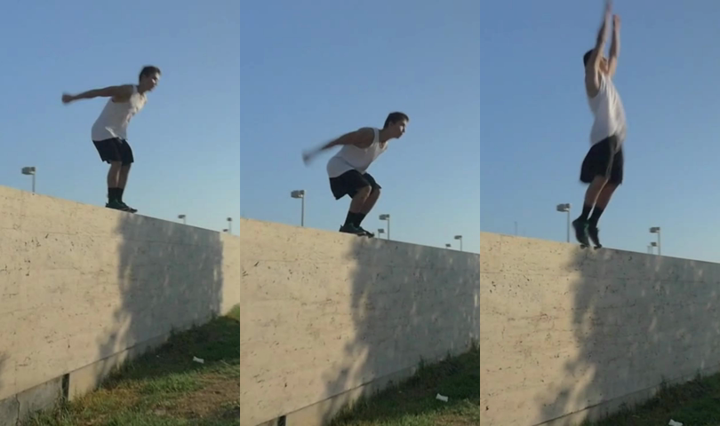

**What crosses the wire is the map, not the policy.** The client works out where
the crop ended up — it is the one that can see the masks and your dragging — and
sends `{w, h, k, place:[[x0,y0], …]}`, one placement per frame of the window.
`server/render.py` applies exactly those numbers and implements no notion of
following, smoothing or clamping at all, so there is no second opinion to drift
from the preview's. The matched original cut and the `.dots.gz` take the same
block, which is what keeps the three files framed identically — and is why a
canvas makes the original cut take the frame-by-frame encode path instead of
handing ffmpeg the JPEGs untouched.

`GET /api/meta` advertises `"canvas": true`; a server that does not is used
exactly as before, and the page keeps the source's own shape. A block that
could not be encoded — an odd dimension, a scale that is not finite, a
placement list that is not one entry or one per frame — is a 400 with the
sentence in it, from `render.canvas_plan()`, before anything is encoded.

The source clip's frames are normalised to 720p on the way in, so an overlay
crop to 9:16 is a 405×720 rectangle **scaled 2.67× to fill 1080×1920** — real
footage, really upscaled, and the note under the control says so in those words
whenever it is over 1.05×. A cutout has no such problem: its dots are computed
at 1080×1920 in the first place.

Measured on the reference clip (2 s window, one tracked subject, 60 frames,
`docs/verify-report.json`, flow `canvas`):

| | |
|---|---|
| 9:16 cutout export | 1080×1920, 60 frames, dots 2.7–4.5 % of the frame, subject centred to within 25 % of the width on every sampled frame |
| `.dots.gz` for it | `w`/`h` = 1080/1920, **0** dots outside the canvas |
| 9:16 overlay + matched cut | both 1080×1920, both 60 frames, both `30/1` |
| following crop vs mask centroid | crop travelled **49.1 px**, the subject **53.7 px**; worst horizontal miss **3.2 px** of a 405 px window |
| 1:1 still | 1080×1080 PNG, `sample-dots-1x1.png` |
| 9:16 sequence | document 1080×1920, 52,134 dots, **0** outside the frame |
| an odd canvas size | `400 canvas must be a positive even size, got 1081x1920` |

And in the tab (`docs/verify-web-report.json`, flow `canvasBrowser`), on the
whole 5 s clip: the crop path built from 150 frames of mask logits in **2.0 s**,
the preview canvas 1080×1920, the 9:16 WebM and its matched cut both 1080×1920
at 150 frames, the `.dots.gz` 1,081,317 dots with none outside the frame, and a
0.1-of-the-source nudge moving the crop by exactly **128 px** of 1280. Auto
chose **follow** there — over five seconds the athlete's box spans 592 px, and
the 9:16 window is 405 — where the two-second window above chose to hold still.
That is the same rule answering two different questions.

### 4 · Palette
18 presets — Black & White, Sage, Forest, Ember, Mist, Game Boy DMG, four
monochromes, CMYK, RGBY, Black White Red, Purple & Green, Blue & Yellow,
Commodore 64, 4 Greys, 8 Greys — plus **from image** (median-cut extraction from
the current frame) and a free colour editor. With subjects — tracked in a clip
or selected in a photograph — you get one palette per subject *plus* one for the
background.

### 5 · Export
Stills render at full source resolution in the tab and download as PNG, on both
engines — the masks are resampled up, so a subject selected at 1600 px comes out
at the file's own size.

Two things come with the still flow:

* **transparent background** — one checkbox, offered whenever the picture has a
  flat background to remove (a cutout with a subject, or the dots look). The PNG
  is written RGBA with the background at alpha 0 and only the subject or the dots
  opaque. Measured on the reference photograph: **99.3 % transparent, 0.7 %
  opaque**, ffprobe `rgba`.
* **.dots.gz** — the same dot-position file a clip writes, with `n_frames` = 1.
  The player shows it as a static frame. It is offered whenever the dots look is
  on a still, subject or no subject.

Both flows honour the **canvas** — a still exports at exactly the preset's
pixels (`1080×1080` for 1:1), and the filename carries the shape:
`sample-dots-1x1.png`.

Clips get a **format** select, and what is in it depends on the engine.

| Format | id | browser | server | notes |
|---|---|---|---|---|
| MP4 · H.264 | `mp4` | — | ✅ crf 18, yuv420p | writing H.264 in the tab means vendoring ~32 MB of ffmpeg.wasm, which is a bigger download than the tracker |
| WebM · VP9 | `webm` | ✅ `MediaRecorder` | ✅ libvpx-vp9 crf 32 | the browser's default |
| GIF · looping | `gif` | ✅ `web/vendor/gifenc.js` | ✅ ffmpeg `palettegen`/`paletteuse` | 15 or 30 fps, loops forever |
| WebM + alpha | `webm-alpha` | ✅ VP8 (`alpha_mode=1`) | ✅ VP9 `yuva420p` | dots on transparency |
| ProRes 4444 | `prores` | — | ✅ `yuva444p12le` | the lossless-ish alpha master |

Formats the running engine cannot write stay in the menu, greyed, with the
reason — a menu that quietly has three entries in the tab and five on the server
would be worse.

**GIF** is not a consolation prize here. The looks this tool produces are two to
four flat colours, which is exactly what a 256-entry palette is good at: on the
150-frame parkour clip the server's GIF is **161 KB** against **432 KB** for the
same frames as H.264 (measured, `docs/verify-report.json`). The server builds the
palette from the whole clip in one pass (`palettegen stats_mode=full`) and maps
with `dither=none`, because the frames are already flat and a second dither would
fuzz the dots. In the tab, `web/vendor/gifenc.js` is our own ~220-line LZW
encoder: one global colour table taken from the palette you chose, every frame
stored whole, no interframe delta. It holds the whole animation in memory as one
byte per pixel per frame (~0.9 MB a frame at 720p), which the UI says out loud.

**Transparent export** keys the flat background out and leaves only the dots
opaque — `cutout` compose only, since `keep scene` has no background to remove
and a whole-frame dither has nothing to key. Both engines produce it from the
same rule (`p.alpha` in `web/dither.js` and `render.py`), so the transparent file
is the opaque file minus its background. Measured on the parkour clip, frame 10:
**99.3 % of the frame transparent, 0.7 % opaque**, in both the server's VP9 and
its ProRes. Alpha in a lossy codec is a lossy plane — the dots' edges come back a
few values off 255 in WebM, and clean in ProRes.

**Also save the original (matched cut)** is a checkbox under the format select —
video only, off by default, remembered for the session. Tick it and an export
writes a *second* file beside the render, `<name>.original.<ext>`, with its own
download button: the same frames, undithered. That is what makes the pair usable
side by side in an edit — same trim, same frame count, same rate, same size, so
frame *n* of one is frame *n* of the other.

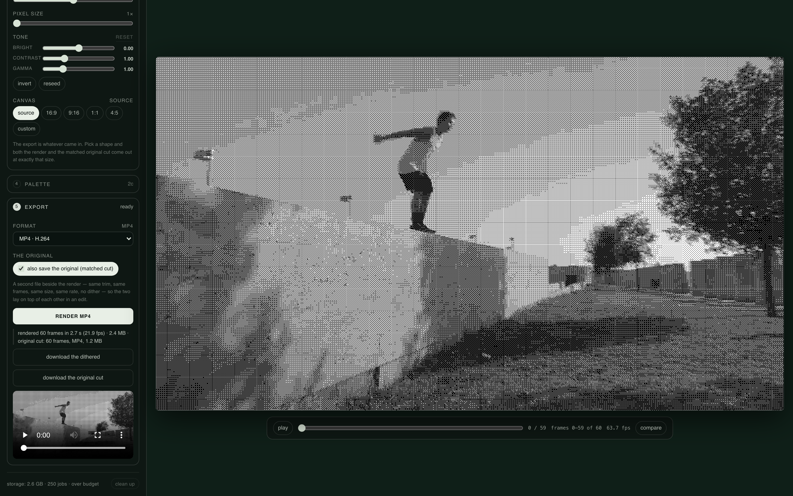

Neither engine re-reads your source file to make it, because the source file is
not what was rendered. The server encodes `jobs/<id>/frames/*.jpg` — the
trimmed, fps-normalised, 720p-or-native frames the dither itself consumed, in
`_list_frames()` order — straight to H.264, and reads ffmpeg's own frame counter
back to prove it wrote every one of them. The tab hands its recorder the same
decoded frame bitmaps the dither was drawn from, through the same
`MediaRecorder`. The count is an assertion on both sides: the page refuses a
file that does not match the render's frame count, and the server refuses the
request (409) before writing one.

Containers pair where pairing means something. MP4 with MP4, WebM with WebM;
**GIF, WebM + alpha and ProRes pair with an MP4** — a GIF of the original would
be decimated to `gif_fps` and pairing a GIF with a GIF is pointless, and an
alpha container has nothing to key out of footage nobody dithered. The tab has
no H.264 encoder at all (see the formats table), so the browser engine always
pairs with WebM.

Measured, server engine, a 2 s window of the parkour clip
(`docs/verify-report.json`): both files 60 frames, 1280×720, `30/1`; frames 0,
30 and 59 of the original decoded and compared against `jobs/<id>/frames/`
`0000.jpg`, `0030.jpg` and `0059.jpg` — mean absolute difference **0.69 / 1.11 /
0.90** out of 255. In the tab (`docs/verify-web-report.json`): both files 150
frames, 1280×720, frames 0, 75 and 149 within **3.09 / 2.24 / 2.27** of
the exact `ImageData` the recorder was handed — VP9 is a lossier round trip than
H.264. The tab's rate is the recorder's wall clock rather than a number either
file was told to carry, so the pair's frame *count* is exact and its frame
*rate* lands within about a percent (measured **1.1 %**, 29.75 against 29.42).

Three things it is honest about. The original is a re-encode of the decoded
frames, not a copy of your file: it carries the extraction's 720p normalisation
and one generation of H.264 or VP9. Its MP4 comes out full-range (`yuvj420p`)
where the dithered MP4 is `yuv420p`, both correctly flagged, because squeezing
the source into limited range to match would cost more than it buys (measured:
mean absolute difference 1.91 instead of 0.69). And in the tab both files are
paced by the recorder's wall clock, so when a heavy look renders slower than
real time the original is handed over at that same slower pace rather than at
the clip's own — the pair keeps one duration between them.

Sequences have no original — there is no single clip behind a strip of morphs —
so the checkbox is not offered in that view.

**Compare** (in the transport bar) drags a before/after divider across the frame,
and it keeps working while the clip plays.

**Dot data** sits under the format select whenever the dots look is on a tracked
clip: `.dots.gz` is the dots themselves — every dot's integer position on every
frame — and `.dots.json` is the same numbers in readable form. See
[Dot data, the player and morphs](#dot-data-the-player-and-morphs).

## Sequences

A sequence is a strip of dot clouds and the transitions between them. It is a
**view, not a step**: the header switches to it, it keeps everything captured
this session, and it survives loading another clip — which is the whole point,
because a morph from one clip into another needs both and only one can be open
at a time.

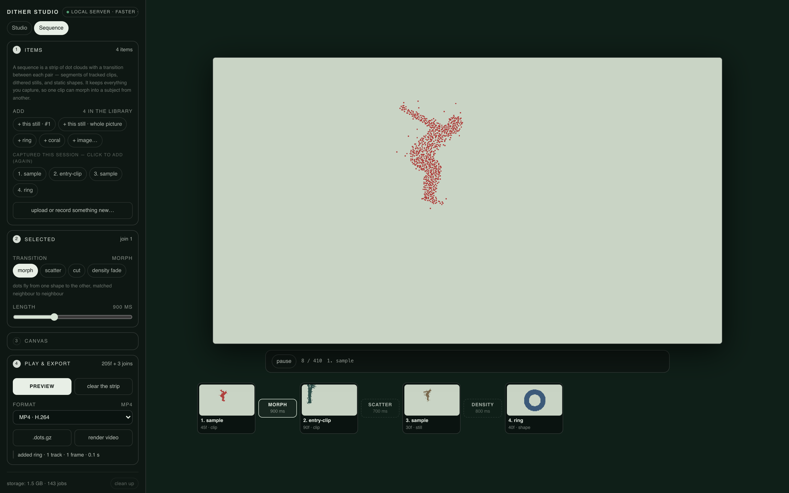

### The strip
Items sit in order, with a **join** between each pair. Drag a card to reorder it
(the join travels with the item that follows it); click a card or a join to
change it in the panel.

**+ add** offers, in this order:

* **this clip** — every tracked subject of the clip open in the studio, at the
  current look, as one item with one track per subject;
* **this still** — the picture open in the studio, as dots: the subjects cut out
  of it if any are selected, otherwise the whole frame;
* **ring**, **coral**, **image…** — static shapes, rasterised into dots through
  the same pipeline a clip is (drawn dark on light, handed to the dots renderer
  with a full-frame mask). A ring is dithered, not plotted;
* **everything captured this session**, so an item can go in twice.

A picture is asked **what it is** before it goes in. **+ image…** offers *whole
image* or *select a subject…*; the second sends it to the studio's subject step —
the live click / box / lasso segmentation, the one that already exists, not a
second copy of it — and the header carries the cutout back. A picture that has
already been segmented in the studio offers **each of its subjects on its own**,
all of them together, and the whole frame, as separate entries; adding two
subjects of the same photograph reuses one library entry rather than dithering it
twice. A camera photo goes the same way: record it, click what you meant, bring
it back.

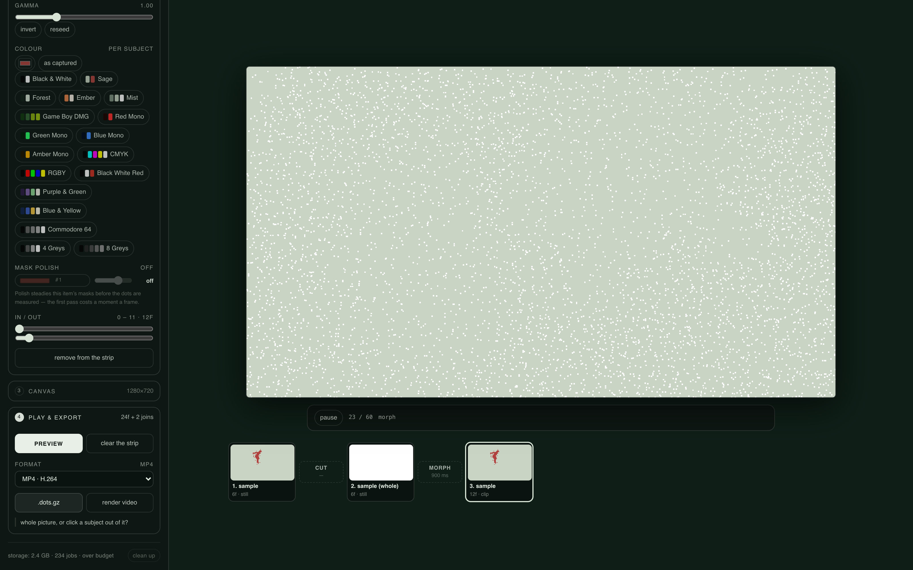

**upload or record something new…** goes back to the studio to bring a source
in; the header then carries a **→ add to the sequence** button back.

### An item's look is its own
Click a card and the panel is the **studio's Look step, scoped to that item**:

* **mode** — Dots, and every other dither mode, [run on the dot grid](#the-modes-on-the-dot-grid);
* **cell**, and for Dots also **count**, **fill**, **stray** and **halo**;
* **gamma**, **invert**, **reseed**;
* a **colour per subject**, or a palette preset applied to this item alone;
* **mask polish**, per subject, at any strength — for a clip item;
* which **subject** (one, or all of them), **in/out** for a clip, **hold** for a
  still or a shape.

Change any of them and only that item's dots move. An item is a **live
reference**, not a picture: it keeps its source — the job's frames and masks for
a clip, the photograph and its masks for a still, the recipe for a shape — and
its own copy of the whole look, and the dots are worked out from the two on
demand. Two cards made from the same capture start identical and diverge freely.

That is affordable because of a cache, one slot per (item, look), holding the
frames that have actually been asked for. Capture seeds the slot for the look
the item was captured at with the exact positions the studio produced, so **an
item nobody has touched is byte for byte what it always was** and costs nothing
to draw; put a look back and the original comes back out of the cache. Only the
frames inside the trim are ever derived, so moving in/out is cheap.

The item starts on **Dots** whatever the studio is showing, because a dot cloud
is what the studio has always handed the sequence — adding an item still changes
nothing on screen. Its dot count, cell, tone, subject colours and
[mask polish](#mask-polish) come across from the studio as they stand.

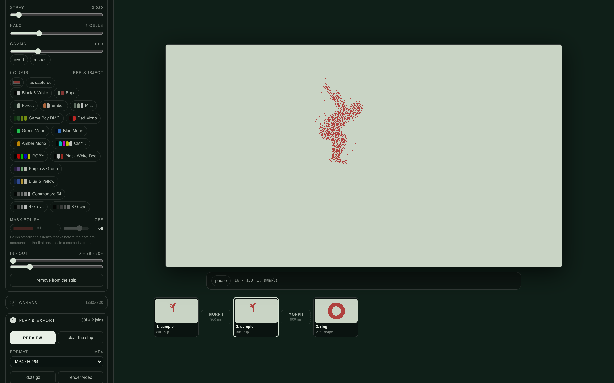

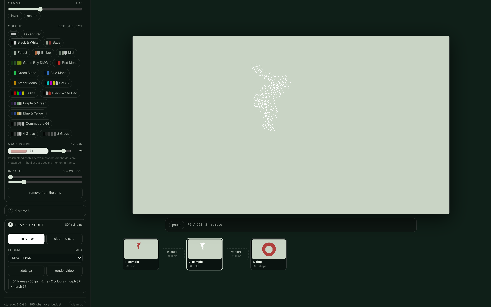

Three cards off one capture and a ring. The middle one is on blue noise at cell
6, gamma 1.4, its own palette and the mask polish; the other two have not moved
a dot — the verification run hashes all three before and after and they come
back identical.

**The look is per item; the background is per sequence.** Background, dot size
and frame size are one set for the whole strip, in **Canvas**, because a
`.dots.gz` holds exactly one of each — the format's whole point is that colour
and dot size are *not* baked into the positions, so a per-item dot size could
not survive an export.

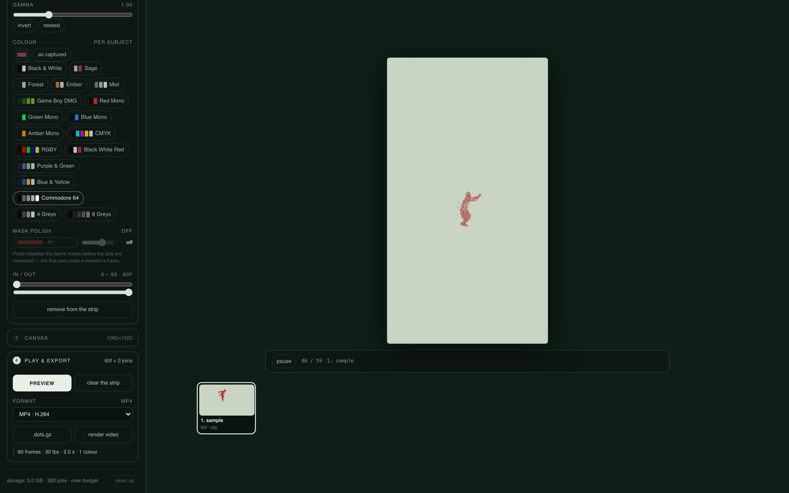

**The strip's frame** takes the same presets the studio's canvas does — source
(the first item's own frame, which is the default and what it always was),
16:9, 9:16, 1:1, 4:5. Items that are not that shape are **placed** on it, and
the two rules are both about what dot positions can survive:

* **the cloud is centred, not the frame it came out of** — a subject that sat
  in the left third of a 16:9 clip belongs in the middle of a 9:16 sequence,
  and the empty pixels around it were never in the file;
* **nothing is magnified** — scaling positions up spreads a cloud without
  growing its dots, so a 2.6× "fit" would be the same subject with gaps in it.
  The scale is `min(1, contain)`: shrink to fit if the item is too big for the
  frame, otherwise leave the spacing exactly as captured.

The studio's canvas has no such limit because it *re-measures* the dots on the
new frame. A strip item is positions, and re-deriving every item on every
preset click is not what this control is for. It also retires the old "these
items are different sizes and will sit off centre" warning — they no longer do.

#### The modes, on the dot grid
A sequence is dot positions and nothing else, so the only question a look has to
answer is *which cells are lit*, and every mode can answer it.

**Dots** answers the way the studio's dots look does: blue noise, a target
count, a fill ratio, stray dots in a halo around the subject. **Every other
mode** takes the same per-cell tone field, treats it as a `gw × gh` greyscale
image — one pixel per cell — and runs it through `web/dither.js` exactly as a
picture, black on white, with the subject's coverage as the gate. A cell is lit
where that comes back black.

So Bayer, halftone, blue noise, white noise, error diffusion and Riemersma all
produce clouds on the same grid; they just disagree about which dots survive.
**Nothing is greyed out** — error diffusion and Riemersma flicker frame to frame
on a clip exactly as they do in the studio, and the chips say so, but they
morph. `count`, `fill`, `stray` and `halo` belong to the dots renderer alone, so
the panel hides them for the other modes rather than pretending they do
something.

**Choosing a pixel mode drops the item to cell 1**, and choosing Dots again puts
the cell back. That is the point of them: Bayer at cell 4 is a chunky screen,
Bayer at cell 1 is Bayer — one dot per lit pixel, a picture rather than a swarm.
The cell slider is still there if you want the screen.

Measured on one 30-frame item, the parkour subject, each mode at the cell it
picks for itself — which is the whole difference between a swarm and a picture:

| mode | cell | dots/frame |
|---|---|---|
| Dots | 4 | **775** |
| White noise | 1 | 10,658 |
| Error diffusion | 1 | 10,668 |
| Bayer | 1 | 10,669 |
| Halftone | 1 | 10,671 |
| Blue noise | 1 | 10,710 |
| Riemersma | 1 | 12,281 |

At a common cell 4 they land within 10 % of each other (700–775): the modes
disagree about *which* cells survive, not how many.

#### Particles, for the flight
A cell-1 pixel mode is hundreds of thousands of dots a frame — the verification
run measures **484,508** for a Bayer dither of a whole 1280×720 photograph. That
cannot fly dot for dot, and should not: a morph is a swarm crossing the frame,
not a photograph teleporting.

So a **join thins whichever side is over a cap** — 8,000 particles, the same
number the Dots look targets — and flies the survivors. The dots the thinning
left behind do not fly: the outgoing item's are **shed in place over the first
fifth** of the flight and the incoming item's **spawn in place over the last
fifth**. The frame a transition starts on is therefore the outgoing item at full
density and the frame it ends on is the incoming one, with the loosening only in
between — which is the effect, not a compromise.

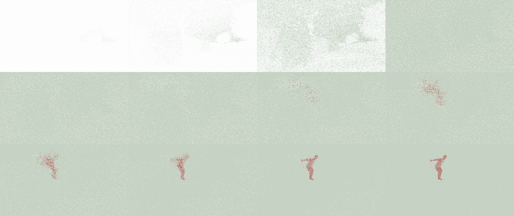

Measured on that join (Bayer whole picture → parkour subject on Dots, 900 ms):

| | dots |
|---|---|
| the Bayer item, a frame | 484,508 |
| the transition's first frame | 484,505 — the item, three dots short of it |
| mid-flight | **3,773** |
| the transition's last frame | 711 — exactly the subject's first frame |
| thinned out of the flight | 477,304 |

The thinning is **density-weighted, not uniform**: the frame is bucketed into a
coarse grid, every occupied bucket keeps at least one dot, and the rest of the
budget is shared out in proportion to how many dots a bucket holds — a thin limb
or an outline survives that, and taking every Nth dot in scan order does not.
The seed comes from the join, so a sequence always flies the same particles, and
the `.dots.gz` and the MP4 contain what the preview showed. `thinCloud` and
`PARTICLE_CAP` are exported from the player module; `buildSequence` takes
`cap: 0` to switch it off.

### Transitions
Four kinds, per join, with a length in milliseconds (900 by default). Click the
join to choose one; shift-click cycles.

| | what it does |
|---|---|
| **morph** | the dot flight: both clouds sorted by Hilbert index and paired rank for rank, staggered, with a perpendicular curl. 900 ms = 37 frames at 30 fps |
| **scatter** | no pairing at all — A's dots are thrown outwards on a random heading with gravity under them and vanish one by one while B's dots come in from scattered positions and settle. 900 ms = 27 frames |
| **cut** | nothing between the two items. 0 frames |
| **density fade** | A snaps to a grid twice the dot cell, then four times, becomes B at that coarseness, and refines back down — five short morphs over progressively smaller dot sets. The picture dissolves into its own resolution rather than flying across the frame. 900 ms = 30 frames |

Colour is carried **through** a transition rather than switched at the end of it:
a dot that has a partner changes hands at the halfway point of its own flight,
and the flights are staggered, so a red swarm becoming a green one changes colour
the way it changes shape. Dots with no partner belong to the side they exist on.

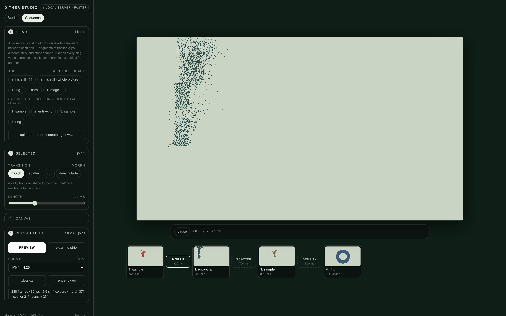

### The look, and getting it out
One background, one dot size for the whole strip, plus a palette preset that
takes the background from the first colour and gives the items the rest in order.
Per-subject colours inside an item are respected until you do that.

* **preview** plays the whole sequence in the player, on the stage, with the
  transport naming the item or transition under the playhead. Adding an item
  rebuilds and plays it immediately.
* **.dots.gz** is the whole sequence as dot positions — one `.dots` subject track
  per distinct colour.
* **render video** hands those same positions to the server (`/api/sequence`),
  which rasterises them into any of the five formats. Without a server the tab
  encodes it itself, through the *same* machinery a clip export uses — WebM, GIF
  and alpha WebM, MP4 and ProRes greyed out with the reason.

Because a sequence is dot positions and nothing else, it survives an engine
switch: build it on the local server, then export it from the tab, or the other
way round.

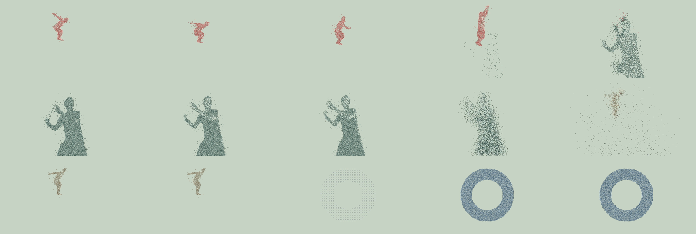

Fifteen frames of the MP4 the verification run produces: the parkour athlete in
red, a morph, the tennis player in green, a scatter, the photograph's subject in
brown, a density fade, the ring in blue.

A sequence is still not a timeline: items in order, one transition per join, one
background. No layers, no easing curves, no audio. What it does have is a colour
per item and four ways to get from one to the next.

## Dot data, the player and morphs

The dots look is the one part of this tool whose output is not really pixels: it
is a few thousand positions a frame. `.dots.gz` stores exactly that, and the
player replays it — same integer positions, same squares, any colour or dot size
you like afterwards, because none of that is baked in.

### Sizes, measured
The 150-frame parkour render, one tracked subject, 1,185 dots a frame on average
(the run in `docs/verify-report.json`):

| file | bytes | what it is |
|---|---|---|
| `.dots.gz` | **69,703** | the dot positions, delta-coded and gzipped |
| `.dots` (raw) | 362,047 | the same, ungzipped |
| `out.mp4` | 432,303 | H.264 of the same frames |
| `.dots.json` | 1,753,313 | the debugging variant |

The dot data is **6.2× smaller than the MP4** and re-colourable, re-sizable and
seekable to a frame without a decoder. It is not always that way round: the
300-frame tennis render (5,977 dots a frame — a much bigger subject) is 222,722
bytes of `.dots.gz`. Dots cost bytes; pixels cost the same whatever is in them.

### The format
`gzip(body)`, extension `.dots.gz`, everything little-endian. The full spec lives
in the header of `web/player/dither-player.js`; in short:

```
off  size          field
0    4             magic "DOTS"
4    1             version = 1
5    1             flags (0)
6    2   uint16    width
8    2   uint16    height
10   2   uint16    n_frames
12   1   uint8     fps
13   1   uint8     dotpx           dot square, in pixels
14   1   uint8     n_palette       1..255
15   1   uint8     n_subjects      1..255
16   1   uint8     bg_index        palette entry the background uses
17   1   uint8     reserved = 0
18   n_palette*3   palette, RGB bytes
..   n_subjects    one uint8 palette index per subject (its dot colour)
..   frames        per frame, per subject:
                     varint count
                     count x  zigzag-varint dx, zigzag-varint dy
```

`dx`/`dy` are deltas from the previous dot of the same subject in the same frame
(the first from 0,0). Dots come out of the renderer in cell-scan order, so those
deltas are small and repetitive, which is what makes the gzip do so well.

Both engines write it, from the same decision the picture is made of: the browser
runs `dotsOn()` in `web/app.js`, the server runs `dots_on()` in
`server/render.py`, and the video renderer paints the very same cells. So the
data cannot drift from the frames.

### The player
`web/player/dither-player.js` is dependency-free, no build step, and loads two
ways:

```html
<script src="dither-player.js"></script>
<script>
  const p = new DitherPlayer.Player(document.querySelector('canvas'),
                                    { loop: true });
  await p.load('clip.dots.gz');     // .dots.gz, .dots or .dots.json
  p.play();                          // pause() · seek(n) · set({bg, colors, dotpx})
</script>
```

```js
import { Player, buildTransition, buildSequence } from './dither-player.mjs';
```

`web/player/demo.html` is a page around it: drop a file (or `?src=…`), scrub,
change the dot size, the dot colour, the background, or turn the background off
entirely for a transparent page. Decompression is `DecompressionStream`, which is
in the browser already.

**It is a replay, not a re-dither.** The player rasterises a dot the way both
renderers do — a `dotpx` square centred on the integer position, clamped into the
frame rather than clipped — so the canvas comes out identical. Measured in
`verify-web.mjs`: on the browser engine, **0 of 3,686,400 bytes differ** between
the app's own rendered frame and the player's replay of the exported positions.
On the server engine one to three dots a frame land differently (9 bytes each):
the dots are decided in numpy there and painted in JS here, and a cell whose
weight sits within a float rounding error of the blue-noise threshold can fall on
the other side of it. That is measured rather than hidden.

**Speed.** 1280×720, ~5,800 dots a frame: **1.94 ms** of CPU per frame on an M4
Pro (worst 4.7 ms), i.e. about 500 fps of rasterisation. The demo page sustained
**120 fps** in the verifier — twice the 60 fps the flagship check asks for.

### Transitions, in the player
`buildTransition(a, b, {kind, durationMs, …})` takes one dot cloud to another and
returns a list of `{a, b}` frames — the dots still reading as the outgoing cloud
and the ones that have become the incoming one. That split is how a sequence
carries a colour per item without a per-dot palette.

**morph** is the original, from the image demo this came from:

* **matching** — both clouds are sorted by Hilbert-curve index and paired rank
  for rank, so neighbours stay neighbours and the swarm flows instead of
  scrambling.
* **counts** — the two clouds are never the same size. The overlap is paired
  1:1; the surplus **pops**, each dot at its own moment spread across the whole
  flight. Dots are binary — there is no opacity to fade — so the stagger is what
  makes it read as a dissolve rather than a cut.
* **flight** — per-dot delay from noise plus a spatial wave, ease-in-out cubic,
  and a perpendicular curl that peaks mid-flight.
* **colour** — a paired dot changes hands as it passes the halfway point of its
  own flight; a partnerless dot belongs to the side it exists on.

A 900 ms morph at 30 fps is 37 frames. Going from the parkour athlete (1,863
dots) to the tennis player (6,446), the count climbs smoothly frame by frame:
1863, 1873, 1903, 1956, 2051, … 6245, 6332, 6396, 6427, 6441, 6446.

**scatter** does not match anything: every dot of A gets a random heading, a
speed and a gravity, and gives up at its own moment; every dot of B starts from a
scattered position of its own and eases in. A dot that leaves the frame is
dropped rather than clamped — a clamped dot piles up against the edge and the
edge lights up like a bar.

**density fade** is a ladder rather than a flight. `regrid(xy, cell)` snaps a
cloud to a coarser grid and lets the duplicates collapse — a 400-dot ring at cell
16 is 87 dots that still read as a ring — and the transition walks A down two
rungs, swaps to B at the coarsest one, and walks back up. Five short morphs over
small clouds, which is both cheaper than one long morph over big ones and a
different effect.

**cut** returns no frames at all.

**Where the tween runs.** In JS, always — in the page for a preview or a WebM,
and in the page for an MP4 too: the finished dot positions are POSTed to
`/api/sequence`, and the server rasterises what it is given. Porting four
transitions into `render.py` would have meant two implementations of the same
easing, two RNGs and a parity gate to keep them honest; shipping positions means
there is one of each. The server's half is 127 frames of squares in **0.73 s**.

## The two engines

### One dither engine, three implementations

The browser preview is not an approximation of the export — it is the same
algorithm. `server/parity.py` runs 110 cases (every mode, all 14 kernels with
serpentine on and off, three palettes, the tone controls) through the Python and
the JavaScript implementations and requires **byte-identical** output, then
repeats the whole set through a subject mask. A second gate takes the finished
*picture* rather than the kernel — 15 cases of `render._frame_pixels` against
`composeFrame`: whole frames and masked ones, two subjects with a palette each,
cutout and overlay, chunky pixels, and the transparent variant the alpha exports
use. That is the code path a still cutout PNG goes down. The browser engine's
export uses the same `dither.js` the preview does, so it is identical by
construction.

Getting there needed three fixes worth remembering, because each produced
*visible* pixel differences that error diffusion then amplified:

* **Float width.** JavaScript Numbers are f64 and only the `Float32Array` *store*
  rounds. The C loop uses `double` locals with float32 storage to match, and
  `tone_lut()` computes in float64 and casts once.
* **FMA contraction.** `cc -O3` fuses `a + b*c` into one instruction that rounds
  once where JS rounds twice, so the build uses `-ffp-contract=off`.
* **RNG.** Both sides use a portable integer hash (`hash01`) instead of
  `numpy.random` / `Math.random` for jitter and stray fields.

The one thing that is *not* shared is the blue-noise tile: the server generates
it with an FFT high-pass and numpy's RNG, which is not portable. So the server's
default seed-7 tile ships as `web/bluenoise.json` and both engines start from the
same field; **reseed** in the browser generates a fresh tile with the same
construction and a portable hash, which is a different realisation of the same
spectrum.

**The dots look is the honest exception.** `parity.py` gates `dither_rgb`, not
the dots stage: that one sums a whole cell's worth of tone in numpy on one side
and in JS on the other, and a cell whose weight lands within a float rounding
error of the blue-noise threshold can fall either way. Measured on the parkour
clip, that is **one to three dots a frame out of ~1,200** — visible only if you
diff the frames, which `verify-web.mjs` does. Within one engine there is no
ambiguity at all: the browser's `.dots.gz` replays byte-identically against the
browser's own render, and the server's against the server's.

### One tracker, two ports

`coreml/` runs EdgeTAM's three heaviest stages as CoreML graphs with PyTorch
holding the rest. `onnxexport/` goes further and exports *five* graphs, because a
browser has no PyTorch to fall back to when a shape is unusual: the memory
attention is exported once at full memory length with an additive key mask, the
SAM heads become a graph with `NonZero` re-derived as arithmetic, and the mask
prompt gets its own graph. `web/track.js` reimplements sam2's memory-bank
bookkeeping in JS around them. `docs/track-web.md` is the full account.

They agree. Against the same 1024 px fp32 torch reference on the same clip, the
server's 768 px torch path scores IoU **0.9668** and the ONNX export scores
**0.9681** (fp32) / **0.9666** (fp16). In the actual browser it is 0.9535, and
the gap is the canvas resampler, not the port — feeding the Python loop a box
filter instead of bilinear moves it to 0.9295 with the model untouched.

### Performance

150-frame 1280×720 clip, one subject, 768 px tracker input, M4 Pro / 24 GB.

| | tracking | first-frame preview | video export |
|---|---|---|---|
| **browser** (WebGPU fp16) | **12.4 fps** (80.7 ms/frame) | 0.14 s | 29 fps → WebM |
| **browser** (WASM, 8 threads) | 2.05 fps | — | — |
| **local server** (CoreML) | **20.9 fps** | 0.13 s | 14.5 fps → MP4 |
| local server (torch MPS) | 15.4 fps | — | — |
| **A100** (EdgeTAM's own figure) | **~150 fps** | — | — |

The A100 row is EdgeTAM's published number, *"obtained with torch compile"* — not
measured here. It is in the table because it is the reason the third tier is
worth building: the same `server.py` on rented silicon is an order of magnitude
faster than the Mac under it.

Per stage in the browser, each graph run 20× in isolation with a CPU readback
(the only way to get an honest number out of an async backend):

| | WebGPU fp16 | WebGPU fp32 | WASM fp16 |
|---|---|---|---|
| image encoder | 24.5 ms | 28.6 ms | 175 ms |
| memory attention | 42.2 ms | 49.5 ms | 252 ms |
| SAM heads | 7.4 ms | 12.3 ms | 23 ms |
| memory encoder | 14.6 ms | 13.7 ms | 58 ms |

They sum to more than the 80.7 ms end-to-end figure, which is the point of
chaining: `encoder → memattn → heads` is wired with
`preferredOutputLocation: 'gpu-buffer'`, so 9.4 MB of feature maps per frame
never come back to JS.

<a id="decoding"></a>
#### Decoding

Getting frames out of a file used to be one `currentTime =` and one `seeked`
event per frame, on the main thread. That is the slowest way a browser can be
asked for pictures — every seek re-primes the decoder and re-decodes the gap
back to a keyframe — and on a cue-less WebM it is a scan of the file each time.

The tab now demuxes the container itself (`web/workers/demux-mp4.js`,
`web/workers/demux-webm.js` — both written here, no vendored demuxer) and runs
`VideoDecoder` once over the stream inside a module Worker, resizing and JPEG
encoding on six `OffscreenCanvas`es as the frames come out. The `<video>` seek
loop is still there and still correct; it is the fallback, and which one ran is
in the engine's decode stats.

Measured in the same headless Chromium on an M-series laptop, the same clip down
both paths, `DV_DECODE_SLOW=1 node verify-web.mjs`:

| clip | `<video>` seek | WebCodecs · worker | |
|---|---|---|---|
| `sample.mp4` — 150 frames, H.264 720p | 4.43 s | **0.97 s** | 4.6× |
| `docs/entry-clip.mp4` — 149 frames, H.264 | 5.59 s | **1.23 s** | 4.5× |
| VP8 WebM, no Cues, no Duration (a camera recording) | 16.05 s | **1.26 s** | 12.8× |
| `sample.mp4` looped to 90 s — 2,700 frames | 192.5 s | **16.5 s** | 11.7× |

The frames are not merely equivalent, they are **byte-identical**: same JPEG
bytes, same total, same FNV hash on the first and last frame of every clip in
that table. Both paths hand the same RGBA to the same encoder, and the grid —
frame `i` is the picture on screen at `t0 + (i + 0.5)/fps` — is computed once,
from the same `<video>` metadata, before either path runs. Nothing downstream
can tell which one decoded the clip.

Where the remaining time goes, for the 150-frame H.264 row:

| | |
|---|---|
| reading the `File` into memory | 6 ms |
| the worker booting (its whole module graph) | 6 ms |
| demuxing 150 samples | 1 ms |
| `drawImage(VideoFrame)` — all 150 | 15 ms |
| decode + JPEG, six canvases deep | 957 ms |

So it is now the JPEG encoder, not the decoder: 4.9 s of `convertToBlob` across
six parallel canvases. The blobs are what everything downstream is built on —
the memory model the estimate panel states out loud, `frameURL()`, and the
sequence library's snapshots, which outlive the clip they came from — so they
stay. Raising the parallelism past six does not help; this was measured.

**It does not block.** Neither path ever produced a long task over 50 ms, because
the seek loop awaited too. What changed is the occupancy: a 16 ms interval
running through the decode came back **0.6 ms late on average on the worker
path against 0.9 ms on the seek path**, over five times fewer ticks.

**Tracking is not in a worker, and here is why.** During a 150-frame single-
subject track (23.1 s wall), the main thread accumulated **69 ms of long tasks
in total** — one task — and that same 16 ms interval ran 2.1 ms late on average.
The ONNX work is already off-thread: `encoder → memattn → heads` is chained on
the GPU and only 192² mask candidates come back. What is left on the main thread
is `preprocess()` normalising 768×768×3 floats, a few ms a frame. Moving the
sessions into a worker would mean moving frame access, the preview path and
`segmentImage` with them, for a UI that is already at ~87% idle. It is written
down as a plan in `docs/track-web.md` rather than done.

**Download.** The page itself is ~200 KB. The first time you track something, the
browser engine pulls **83 MB** — 55.3 MB of fp16 ONNX graphs and 27.7 MB of
onnxruntime-web — and caches it. Nothing comes from a CDN.

**Multiple subjects.** The server batches every subject through one propagate
pass. The browser tracks them one at a time, because a `WebTracker` is a
single-object memory bank, so N subjects cost N × the time. Two subjects over
149 frames: 16.1 s on the server, 25.7 s in the browser.

## Storage: jobs/ and the janitor

`jobs/` is the server's scratch directory. Every clip that goes up gets one:
the source file, `frames/`, `masks/<obj>/`, `polish/` and whatever it was
rendered to. It is roughly 13 MB per 150-frame clip, and it used to grow
forever — two days of ordinary use plus the two suites left **5.4 GB across 323
directories**, most of it throwaways and duplicates of the same five seconds.

`server/jobsgc.py` sweeps it, on startup and every six hours after that:

1. anything untouched past the age limit goes;
2. then, while `jobs/` is still over budget, the **oldest goes first**, one at a
   time, until it fits.

```sh
DV_JOBS_BUDGET_MB=2048     # how much disk jobs/ may hold
DV_JOBS_MAX_AGE_DAYS=14    # how long an untouched job lives
DV_JOBS_KEEP_HOURS=48      # a job used this recently is never touched
DV_JOBS_GC_EVERY_H=6       # how often the sweep runs
DV_JOBS_GC=0               # turn the whole thing off
```

Two rules keep it from eating anything that matters.

**Nothing used in the last 48 hours is ever touched**, in either pass. "Used" is
the newest of the job directory's own mtime and a `.access` stamp the server
writes on any `/api/jobs/<id>/*` call — reading a frame changes nothing on disk
otherwise, so a clip someone is looking at right now would look ancient without
it. Forty-eight hours is orders of magnitude longer than any flow, which is why
a sweep firing in the middle of a track → render cannot hurt it; `verify.mjs`
run `gc` fires one every 1.5 s through a whole tracked render to prove it.

**A recording is trimmed, not deleted.** A job whose `filename` starts with
`camera-` or `photo-` came out of the webcam and exists nowhere else on the
machine. Past the age limit those lose `frames/`, `masks/`, `polish/`,
`preview/` and every render — everything `reextract` can rebuild — while
`meta.json` and the original stay: `source.webm` for a recording, and for a
photograph `frames/0000.jpg`, which *is* the picture, since a still job has no
source file. Everything else, `seq-*` rasterise directories included, is deleted
whole.

The accounting is hard-link aware. `POST /api/jobs/<id>/reextract` links the
source into the new job rather than copying it, so removing one of two jobs that
share a clip frees only that job's own bytes, and that is what the numbers say.

```
GET  /api/gc/status     budget, age limit, current usage, the last sweep
POST /api/gc/run        sweep now, same policy — what the button calls
```

In the page, at the foot of the panel: `storage: 592 MB · 70 jobs` and a **clean
up** button. Server engine only — the browser engine writes nothing to disk.

## Hosting a paid backend

The seam is built; the billing is not, and this repository is not going to grow
it.

`server.py` reads one optional environment variable:

```sh
DV_API_KEY=$(openssl rand -hex 24) DV_PORT=8765 env/venv/bin/python server/server.py
```

With it set, every `/api/*` request must carry `Authorization: Bearer <key>` or
gets a 401. The page and the static assets stay open, because a browser cannot
put a header on the request that loads the HTML. `GET /api/meta` reports
`"auth": "bearer"` so a client knows before it tries. `DV_CORS_ORIGINS` narrows
CORS from the default `*`.

On the page: the engine chip → **Custom URL** → the base URL and the key. The
same `engines/remote.js` drives it; there is no separate client and no premium
code path.

A deployment sketch, unbuilt but not hand-wavy:

```
  Cloudflare / nginx            a CUDA box (A10G, L4, A100…)
  ┌──────────────────┐          ┌───────────────────────────────────┐
  │ TLS              │          │ DV_API_KEY=<per-customer>         │
  │ rate limit       │─────────▶│ DV_DEVICE=cuda DV_BACKEND=torch-  │
  │ key -> customer  │          │            compiled               │
  │ meter /track     │          │ server/server.py                  │
  └──────────────────┘          │ jobs/ on a scratch disk, GC'd     │
                                └───────────────────────────────────┘
```

What you would actually have to do:

* **CUDA.** `DV_DEVICE=cuda`. The CoreML backend is Apple-only and falls through
  to `torch-compiled` on its own; EdgeTAM's 150 fps figure *is* the compiled
  torch path, so that is the right backend there. The `_gpu_lock` in `server.py`
  serialises one track at a time per process — run one process per GPU behind
  the proxy rather than trying to share.
* **Retention.** `jobs/` is swept on a budget and an age limit — see *Storage:
  jobs/ and the janitor* — but the defaults (2 GB, 14 days) are a laptop's, not
  a tenant's. A hosted deployment wants `DV_JOBS_BUDGET_MB` sized to the scratch
  disk, a much shorter `DV_JOBS_MAX_AGE_DAYS`, and a per-customer policy on top:
  the janitor knows nothing about who owns a job.
* **Metering.** Count tracked frames, not requests: `POST /track` returns
  immediately and the work is in the worker. `GET /status` already reports
  `done_frames`, `elapsed_s` and `image_size`.
* **The free tier does not get worse.** The browser engine is the product for
  most people, and it costs the operator nothing. Neither tier caps clip length.
  The paid tier buys speed and 1024 px tracking — a 90-second clip opens in 3
  seconds there against 5.7 minutes of `<video>` seeking in a tab — not the
  feature list.

## Verification

Two headless suites, both against a real server, a real EdgeTAM run and real
ffmpeg. No mocks.

```sh
./run.sh &
node verify.mjs                     # defaults: :8765, sample.mp4, sample.jpg
node verify-web.mjs                 # + docs/entry-clip.mp4
env/venv/bin/python server/parity.py && GATE=1 env/venv/bin/python server/parity.py
```

Both suites run from a fresh clone with no arguments and no files to place:
`sample.mp4` (5 s, 1280×720, 30 fps, 150 frames) and its first frame
`sample.jpg` are committed for exactly that reason. Every argument is still
positional and optional:

```sh
node verify.mjs     http://127.0.0.1:8765 clip.mp4 still.jpg
node verify-web.mjs http://127.0.0.1:8765 clip.mp4 docs/entry-clip.mp4 still.jpg
```

`verify.mjs` drives the **server engine**: a still through every algorithm, a
still dotted whole-image down to a one-frame `.dots.gz`, a still with a clicked
subject segmented in one frame and exported as a transparent PNG, a whole-frame
clip, two tracked subjects, one subject at a non-default tracking quality, a
polygon mask prompt with a frame preview, the **matched cut** — a 2 s window
exported with *also save the original* on, both files through ffprobe (60
frames, 1280×720, `30/1`, identical), three of the original's frames compared
against the very JPEGs in `jobs/<id>/frames/` the render read, the second
download saved and named, a deliberately wrong frame count refused with a 409,
a GIF export pairing with an MP4, and the checkbox remembered across a reload
and withheld from a still — the **canvas**: a 9:16 cutout whose dots are
re-measured at 1080×1920 and checked frame by frame for a subject that is
actually in shot, a 9:16 auto-reframed overlay whose crop centre is compared
against the tracker's own mask centroids from `/centroids` (49.1 px of crop
travel against 53.7 px of subject, worst horizontal miss 3.2 px), the matched
original cut on the identical path (both 1080×1920, both 60 frames), the
`.dots.gz` and the sequence at the same shape, a still at 1:1, and an odd
canvas size refused with a 400 — and **mask polish**: the motion gate as numbers,
the tab's polished mask against the server's own byte for byte, the before/after
wipe, and preview against the exported MP4 — and the **jobs/
janitor**: fabricated job directories with backdated mtimes (a stale one, a
fresh one, a `camera-` recording, a `photo-`, a `seq-*`) swept through the live
`POST /api/gc/run`, then a sweep every 1.5 s through a real track → render to
show the 48 h grace holds. `server/jobsgc_check.py` checks the same policy — age,
budget eviction oldest-first, the grace window, the hard-link accounting —
against temp directories in a second, with no server at all:

```sh
env/venv/bin/python server/jobsgc_check.py
```

`verify-web.mjs` drives the **browser engine** and the seam between the two: the
auto probe and the manual switch, a still, whole-image dots on a still, a still
subject **on both engines**, a whole-frame clip, a tracked subject (exported with
the mask polish on), a polygon through the `heads_mask` graph, two subjects
prompted on two different frames — and the same two-frame test on the server
engine, so the feature is checked on both. It exports a **pair** in the tab too:
a dithered WebM and the matched cut beside it, both 150 frames at 1280×720 at
the same rate to within about a percent, three frames of the second one
checked against the exact `ImageData` the recorder was handed, and the checkbox
confirmed absent from the sequence view.

It runs the **canvas** on the engine with no server at all: the crop path built
in the tab by walking 150 frames of mask logits, the preview canvas at
1080×1920, a 9:16 WebM and its matched cut agreeing on every field ffprobe
reports, the file named `sample-dots-9x16.original.webm`, a hand-nudge moving
the crop by the fraction it was given, and a sequence re-fitted to 4:5.

Its flagship run is the **sequence
view**: four items added through the UI the way a person would — a subject
tracked in one clip, a subject tracked in a second clip, a subject cut out of a
photograph, and a ring — trimmed, coloured, joined by a morph, a scatter and a
density fade, reordered by dragging, previewed, exported as `.dots.gz` and
rendered to MP4 by the server. A second sequence run then proves the item look
is **per item**: three cards, the middle one taken through every mode, given a
palette, a coarser cell, a stronger gamma and the mask polish, while items 1 and
3 hash identically before and after — in the strip, in the built document, and
in the `.dots.gz` the server rasterises. A third proves the two things that only
matter together: a **cell-1 Bayer** dither of a photograph (484,508 dots a frame)
morphing into a tracked subject drawn with Dots, with the flight capped at 3,773
mid-air and both ends at full density; and a picture brought in from the sequence
being asked what it is — *whole image* or *select a subject…* — and coming back a
cutout. It also starts a second server with `DV_API_KEY` set and checks
401 / 401 / 200. It picks a browser rather than assuming one: headless Chromium
with the WebGPU flags, then `channel:'chrome'`, then the WASM backend over a
shorter clip with the report saying so.

`parity.py` runs two gates. The **kernel gate** is the 110 cases: every mode, all
14 error-diffusion kernels with serpentine on and off, three palettes and the
tone controls, `dither_rgb` against `ditherRGBA`, byte for byte —
`GATE=1` repeats the whole set through a subject mask. The **compose gate** is
the picture rather than the kernel: whole frames and *masked* ones, two subjects
with a palette each, cutout and overlay, chunky pixels, and the transparent
variant — `render._frame_pixels` against `composeFrame`. That second gate is the
still cutout PNG's own code path. The **polish gate** is the third: a synthetic
nine-frame sequence with a slow body and a fast ball in it, at three strengths,
`polish.polish_sequence` against `polishSequence`, float for float — plus the
browser's own shortcut (polishing the padded bounding box rather than the whole
frame) against the whole frame. Polish sits *upstream* of composition — it
changes the masks, not the way masks are composed — so it is its own gate rather
than more compose cases; what the compose gate already proves is that identical
masks compose identically.

Latest run (M4 Pro, 24 GB, macOS 26.1, torch 2.13 / MPS + CoreML; headless
Chromium with a real WebGPU adapter), 150-frame 1280×720 clip:

| | result |
|---|---|
| engine parity, kernels | **110/110 byte-identical**, and 110/110 again through a mask |
| engine parity, compose | **15/15 byte-identical** — whole, cutout, overlay, two subjects, chunky pixels, alpha |
| engine parity, polish | **27/27 float-identical** (3 strengths × 9 frames); crop shortcut vs whole frame, max difference **0** |
| `verify.mjs` | 15 flows, **0 console errors** |
| `jobsgc_check.py` | **29/29**, six cases, no server and no real jobs/ |
| jobs/ janitor, live | a stale job deleted, a fresh one kept, a `camera-` job trimmed to `source.webm` + `meta.json`; **12 sweeps** fired through a real track → render and it finished untouched |
| `verify-web.mjs` | 21 flows, **283/283 assertions**, **0 console errors** |
| sequence: an item's look | item 2 through all 7 modes, a palette, cell 6, gamma 1.4 and polish 70 — items 1 and 3 **hash identically** before and after (`c7b68293`, `a9e6316d`), item 2 goes `c7b68293` → `2853216c` and back again |
| sequence: pixel modes | a cell-1 Bayer photograph is **484,508 dots a frame**; its morph flies **3,773** mid-air and lands on 711, the subject's own count |
| canvas: 9:16 cutout | 1080×1920, 60 frames, dots 2.7–4.5 % of the frame, the subject centred to within 25 % of the width on every sampled frame; its `.dots.gz` is 1080×1920 with **0** dots outside |
| canvas: 9:16 overlay + cut | both 1080×1920, both 60 frames, both `30/1`; forced to follow, the crop travelled **49.1 px** against the subject's **53.7** and never missed it by more than **3.2 px** of a 405 px window |
| canvas: in the tab | the crop path built from **150 frames** of mask logits in **2.0 s**, preview canvas 1080×1920, the pair written at 1080×1920 / 150 frames each |
| canvas: auto framing | the 5 s clip answers **follow** at 9:16 (the subject's box spans 592 px of a 405 px window) and the 2 s window answers **hold still** |
| still: 14 kernels | **14 distinct** images, no two kernels alike |
| still: subject, server | one frame, **0.09 s** at 768 px, a 12,750 px mask, no propagation |
| still: subject, browser | one frame, **0.08 s** at 768 px, a 12,654 px mask, WebGPU fp16 |
| still: cutout PNG, alpha | 1280×720 `rgba` on both engines · **99.3 % / 99.4 % transparent**, 0.7 % / 0.6 % opaque, ffprobed |
| still: whole-image dots | **31,500 dots**, and a one-frame `.dots.gz` whose positions the player replays |
| browser: clip decode | 150 frames in **5.0 s**, in the tab |
| browser: frame-0 preview | **0.14 s** once the graphs are warm (1.6 s including the load) |
| browser: track | 150/150 frames in 12.8 s (**11.7 fps**), WebGPU fp16 |
| browser: mask prompt | tracked from a polygon alone, non-empty on 150/150 frames |
| browser: dots preview | 56.8 fps · 774 dots (9.8 fps on the first polished frame, 95 fps once its masks are cached) |
| browser: export | 150 frames of VP9 WebM in 8.0 s **with polish on**, 1280×720, ffprobed |
| server: track, 2 subjects | 150/150 in 13.0 s (**11.5 fps**) end to end, CoreML |
| server: track, 1 subject @ 512 px | 150/150 in 7.8 s (**19.3 fps**), masks still 1280×720 |
| server: track from a polygon | mask-prompt vs box-prompt IoU **0.978 mean / 0.928 worst** |
| server: export | 150 frames of H.264 in 10.4 s, ffprobed |
| preview vs exported MP4 | **97.8 %** of pixels within 30 RGB units |
| polish: tab vs server mask | **0 of 921,600** pixels differ on the same frame at strength 70 |
| polish: preview vs export | **99.3 %** of pixels within 30 RGB units, polish on |
| sequence: 4 items, 3 joins | 243 frames = 45+37+45+21+30+25+40, exactly its items plus its joins |
| sequence: colours | 4 item colours + background survive into the `.dots.gz` palette |
| sequence: MP4 | **243/243 frames** ffprobed off `/api/sequence`, 1.6 MB H.264 |
| sequence: replay | the 338 KB `.dots.gz` plays back at **120 fps**, 1.5 ms a frame |
| range: narrowing after a track | server engine fires **no** `/track`, `/reextract` or `/upload`; browser engine touches **no API at all**; job id and frame count unchanged |
| range: what the window exports | render **30/30**, matched cut **30/30**, `.dots.gz` **30 frames** — for a 60-frame tracked clip windowed to frames 15–44 |
| range: frame-exactness | cut frame 0 vs `frames/0015.jpg` mean abs diff **0.647** (control against `frames/0000.jpg`: **19.99**); the tab's pair **3.035** vs its own frame 15 through VP9 |
| range: dot positions | the window's `.dots.gz` is byte-identical to frames 15–44 of the whole clip's document — the mask offset is right |
| range: widening | the offer names **frames 60–119**, fires nothing until it is taken, then re-extracts and re-tracks 120 frames in **8.0 s** (server) / **12.8 s** (tab) |
| `DV_API_KEY` | bare 401 · wrong key 401 · right key 200 · the page still 200 |

The remaining 2.2 % of the preview-vs-export comparison is not an engine
difference — it is the browser's JPEG decoder disagreeing with Pillow's by a
level or two, plus h264 quantisation on the way out. Feed both the same decoded
pixels and they agree exactly, which is what `parity.py` measures.

### Subjects that arrive mid-clip

`docs/entry-clip.mp4` is five seconds of a locked-off park shot
([Mixkit](https://mixkit.co/free-stock-video/view-of-a-park-while-a-girl-runs-across-4831/),
free licence) that a jogger runs into. She is **not in frame until frame 38**.
Both engines are given two subjects: a tree prompted on frame 0, and the jogger
prompted on frame 48, ten frames after she appears.

| | tree, prompted @ 0 | jogger, prompted @ 48 |
|---|---|---|
| server engine | non-empty on **149/149** frames | empty 0–37, **first mask on frame 38** |
| browser engine | non-empty on **149/149** frames | empty 0–38, **first mask on frame 39** |

Two subjects over 149 frames took **16.2 s** on the server and **29.5 s** in the
browser, which is the one-pass-per-subject cost showing up.

Neither was told when she arrives. Both engines walk her backwards out of her
own prompt frame until her object score goes negative, and land one frame apart
from entirely separate code.

The renderer follows: at frame 10 the dot count is the tree's alone — **1346**,
with not one stray dot where she will be — and at frame 100 it is **1787**, the
tree plus her. Dots pop rather than fade, which is what a threshold field does
and what the aesthetic wants.

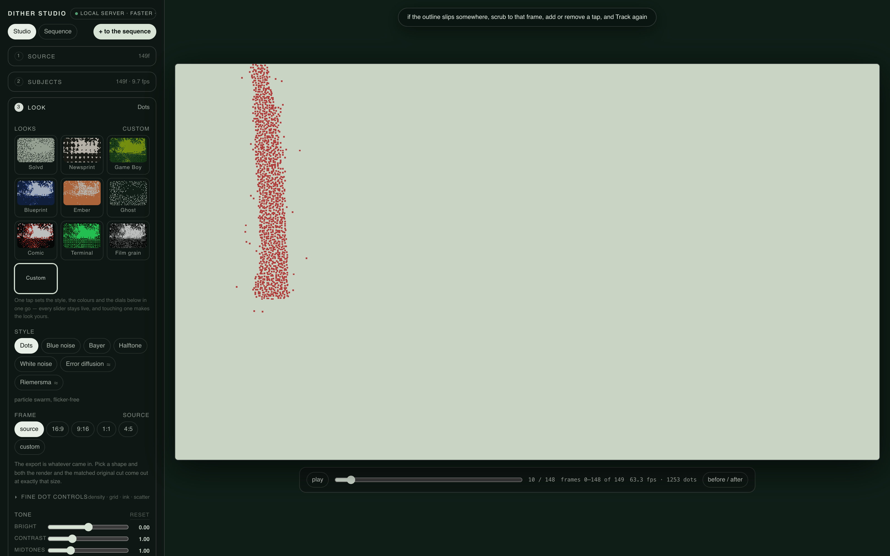
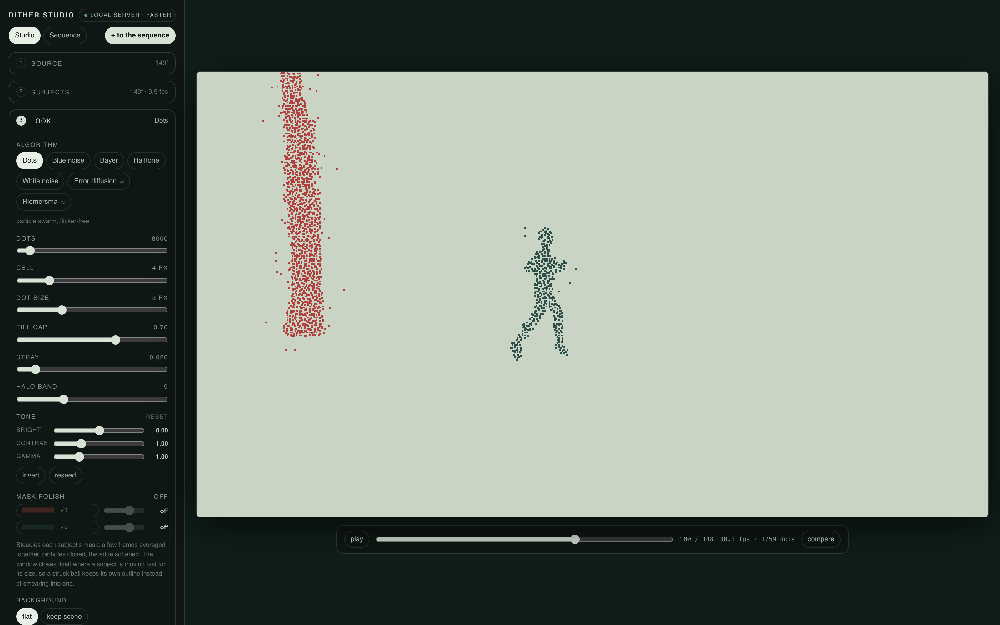

### One bank per subject

Two subjects on two prompt frames is also where SAM2's batched video predictor
breaks, and the park clip only showed the small half of it. `propagate_in_video`
runs every object through a single `output_dict`, and its pre-pass consolidates
*every* prompt frame across *every* object before the first frame is tracked. On
frame 48 the tree had not been tracked yet, so it got the `NO_OBJ_SCORE`
placeholder — and the tree vanished for exactly one frame at 30 fps.

The visible hole is not the damage. That placeholder is written to a
**conditioning** frame, the memory encoder is run over it, and
`max_cond_frames_in_attn` is -1 — so "this object is not here" is attended to on
every remaining frame of the clip, for a subject that was never prompted there.
With two subjects and an early prompt it costs one frame. With three subjects and
a prompt at frame 121 it is fatal: on a 300-frame tennis clip (racket + player
prompted at 0, ball at 121) the **player's mask went empty from frame 119 to the
end**, with the player in the middle of the shot the whole time.

The fix is the one upstream SAM 2.1 shipped: give every object its own memory.
`output_dict_per_obj[i]` already holds exactly object *i*'s conditioning and
non-conditioning outputs, and `_run_single_frame_inference` already takes the
output dict and the batch size as arguments, so
`edgetam_util.propagate_per_object` drives the loop one object at a time against
its own dict. No object ever sees a conditioning frame it was not prompted on and
there is no placeholder left to poison anything. Each subject is walked out from
its own prompt frame in both directions, exactly like the browser engine — two
passes over the frames, so the image encoder still runs once per frame rather
than once per subject per frame.

| tennis clip, 3 subjects, 300 frames, 768 px, CoreML | racket @ 0 | player @ 0 | ball @ 121 |
|---|---|---|---|
| batched (before) | empty 210–270, 277–284 | **empty 119–299** | empty 0–115, 218–299 |
| per-object (after) | empty 210–242, 291–299 | **empty on 0 frames** | empty 0–115, 218–299 |
| each subject tracked alone | empty 210–242, 291–299 | empty on 0 frames | empty 0–115, 218–299 |

The third row is the check that matters: with per-object memory, three subjects
tracked together produce the same runs as three subjects tracked one at a time.
The racket's remaining gaps are EdgeTAM losing a thin backlit racket mid-swing —
it is out of frame for most of 220–240 — and they are identical whether it is
tracked alone or alongside two other subjects.

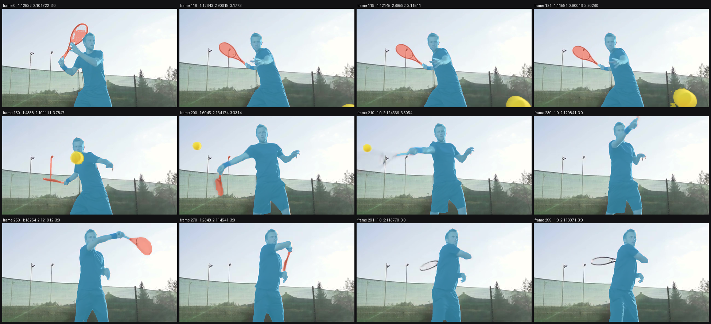

It costs time. Both loops run back to back on the same machine, same warm model,
768 px CoreML: the tennis clip goes **38–43 s → 47 s** (7.9 → 6.4 fps) and the
park clip **14.0 s → 16.2 s** (10.6 → 9.2 fps), because memory attention, the SAM
heads and the memory encoder run once per subject at batch 1 instead of once at
batch N. The image encoder — the expensive part — is unaffected: it is cached per
frame, so N subjects on one frame still encode it once.

Only jobs whose subjects were prompted on **more than one frame** take this path.
A single prompt frame cannot produce a foreign conditioning frame, so it keeps
the batched upstream loop, its numbers and its timings exactly as they were.

## Licence

**Apache-2.0**, matching EdgeTAM, whose weights this cannot work without. MIT
would have been fine for the JavaScript on its own, but a two-licence repository
where the model half is Apache and the code half is MIT is a paperwork tax on
everyone downstream for no benefit. Apache-2.0 also carries an explicit patent
grant, which matters more than usual for something that ships model weights.

What that means in practice:

| | licence | committed here? |
|---|---|---|
| this code (`web/`, `server/`, `coreml/`, `onnxexport/`, `bench/`) | Apache-2.0 | yes |
| [EdgeTAM](https://github.com/facebookresearch/EdgeTAM) + its checkpoint | Apache-2.0 | no — `setup.sh` clones and downloads |
| the derived ONNX / CoreML graphs | Apache-2.0 (derived from the checkpoint) | no — exported by `setup.sh`, or downloaded from [`models-v1`](https://github.com/kcvete/dither-studio/releases/tag/models-v1) |
| [onnxruntime-web](https://github.com/microsoft/onnxruntime) in `web/ort/` | MIT | no — `setup.sh` fetches it from npm |
| `docs/entry-clip.mp4` | Mixkit Free License | yes, **as a test fixture only** |
| `sample.mp4` / `sample.jpg` | Mixkit Free License | yes, **as a test fixture only** |

The two Mixkit clips are in the repository because the tests need real video:
`sample.mp4` is what both suites open when they are given no arguments, and
`docs/entry-clip.mp4` is a shot where something enters frame partway through.
Neither is redistributable as a stock asset and neither is part of the software. Everything else used while building
this was a test input and is not here. `NOTICE` has the full attributions, and
anyone bundling `web/ort/` must carry the MIT notice with it.

## Contributing

[`CONTRIBUTING.md`](CONTRIBUTING.md) has the mechanics — how to get an
environment, which suite to run for which change, what CI checks on its own.
[`CODE_OF_CONDUCT.md`](CODE_OF_CONDUCT.md) and [`SECURITY.md`](SECURITY.md) are
the short ones. What follows is the standard those files are enforcing.

The bar is the same one the code holds itself to: **no mocks in the tests, and a
number in the commit message**. `verify.mjs`, `verify-web.mjs` and `parity.py`
run against a real server, a real EdgeTAM and real ffmpeg, and they should stay
that way — a suite that can pass while the tool is broken is worse than none.

Practically:

* Run both verifiers before opening a PR, and paste what they printed. Zero
  console errors is a hard gate, not an aspiration.
* Touching `dither.js` or `dither.py` means running
  `server/parity.py` **and** `GATE=1 server/parity.py`. They are byte-for-byte
  equal today and that is worth defending.
* Anything that changes tracking speed should come with a `bench/bench.py` run —
  interleaved, three rounds. A straight sequence of backends measures the
  machine's temperature, not your patch.
* Keep the browser engine honest. If a feature only works with a server, say so
  in the UI rather than hiding the button.
* Do not commit weights. `setup.sh` regenerates every binary in this repo.

Open questions worth an issue before code: a WebCodecs decode path (faster than
the seek loop, but frame-accuracy needs proving), 512 and 1024 ONNX exports
behind an opt-in download, and batching multiple subjects into one browser pass.

## How the server tracker got fast

The browser port is documented in `docs/track-web.md`. This is the
CoreML side, and the measurements behind the 20.9 fps above.


EdgeTAM's README quotes **15.7 FPS on iPhone 15 Pro Max** and **150.9 FPS on A100**,
footnoting that the A100 number is *"obtained with torch compile"*; the iPhone number
is the **CoreML export on the Neural Engine**. This tool used to run the PyTorch graph
on **MPS**, a third and slower path. It no longer does — the three modules that are
~90 % of a track step now run as CoreML graphs, and MPS keeps the rest.

Where the time went on MPS (1 subject, 1024 px input, per frame, wall clock with
`torch.mps.synchronize()` around each stage — `bench/profile_stages.py`):

| stage | ms | share |
|---|---|---|
| memory attention | 42.9 | 38 % |
| image encoder (RepViT + FPN neck) | 39.8 | 35 % |
| memory encoder + spatial perceiver | 18.3 | 16 % |
| SAM heads | 10.0 | 9 % |
| everything else | ~2 | 2 % |

So four modules, three of which convert cleanly. `coreml/export.py` writes one
static-shape `.mlpackage` per (graph, object count); `coreml/accel.py` swaps the
three module calls on a live predictor and leaves the memory-bank bookkeeping, the
SAM heads and the propagate loop exactly as upstream wrote them. Every shim checks
its tensors against the exported shape and falls back to PyTorch when they don't
match, which is what makes the cold-start frames (the memory bank is still filling
for the first 16) and un-exported object counts simply work.

Per-call cost of the exported graphs on this machine (`bench/micro_coreml.py`):

| graph | precision | unit | ms | on MPS |
|---|---|---|---|---|
| image encoder | fp16 | GPU | 15.2 | ~40 |
| memory attention | fp16 | GPU | 18.2 | ~43 |
| memory encoder + perceiver | fp32 compute, fp16 in | GPU | 4.8 | ~18 |

Three findings behind those choices:

* **Memory attention needed a real-arithmetic RoPE.** It rotates queries and keys
  with complex tensors (`torch.polar`, `view_as_complex`), and MIL has no complex
  type, so conversion dies with `KeyError: np.int32(9)`. `coreml/wrappers.py`
  recomputes the identical rotation as `a·cos − b·sin, a·sin + b·cos`; parity
  against the stock module is **1.3e-6**.
* **The Neural Engine is fast and wrong here.** The encoder runs 13.2 ms on the ANE
  against 15.2 on the GPU, but its fp16 accumulation moved frame 147 of the reference
  clip to **IoU 0.893** where the same graph on the GPU holds 0.958 (clip mean
  0.993 → 0.998). The 2 ms is not worth a visibly wrong frame, so every graph is
  pinned to `CPU_AND_GPU`.
* **The memory encoder stays fp32.** Its latents *are* the memory bank, so error
  there compounds down the clip; fp16 compute puts an error 4× the signal into them.
  Its *inputs* are fp16 — `pix_feat` is the encoder's fp16 output anyway.

The image encoder also runs one frame ahead on a worker thread: it is a pure
function of the frame, so it does not have to wait for the memory bank. That is
worth 14.6 → 15.4 fps on its own. The numpy → MPS copy stays on the calling
thread; two threads driving the Metal queue trips an `IOGPUMetalCommandBuffer`
assertion.

### Measured

`bench/bench.py` runs any backend over a fixed 150-frame 1280×720 clip with a fixed
prompt, scores every mask against the fp32 MPS output and appends to
`bench/results.md`:

```bash
env/venv/bin/python bench/bench.py --backend coreml --runs 3
```

`fps` is frames ÷ propagate seconds (the GPU→CPU mask copy is in, PNG writing is
out). IoU is binary-at-0.5 against `masks_edgetam/`, per frame. Run-to-run spread
from thermals is up to 1.7×, so these are **one run of each backend per round, three
rounds, interleaved** — a straight sequence of backends measures the machine's
temperature, not the code.

| backend | `DV_BACKEND` | fps best | fps med | IoU mean | worst frame |
|---|---|---|---|---|---|
| CoreML for the three heavy stages | `coreml` **(default)** | **15.57** | **15.40** | 0.9968 | 0.9580 |
| …without the encoder prefetch thread | — | 14.73 | 14.60 | 0.9968 | 0.9580 |
| `torch.compile` on the image encoder | `torch-compiled` | 11.85 | 11.83 | 0.9961 | 0.9589 |
| `model.half()` under autocast | `torch-half` | 9.48 | 9.38 | 0.9963 | 0.9589 |
| fp16 autocast — *the previous default* | `torch` | 9.52 | 9.42 | 0.9984 | 0.9592 |
| no autocast — *the mask reference* | `torch-fp32` | 7.99 | 7.93 | 1.0000 | 1.0000 |

**1.6× over the previous default, 1.9× over fp32**, with the whole-clip mean IoU
at 0.997 and no frame below 0.958. `bench/results.md` has the full set, including
the eight things that did not move the needle.

`DV_BACKEND=` picks one; anything that will not build falls through to the next
row down, so a machine without coremltools still tracks:

```bash
DV_BACKEND=torch ./run.sh      # force the old path
DV_BACKEND=coreml ./run.sh     # the default anyway
```

### Tracking quality — the other 2×

EdgeTAM resizes every frame to a square before it looks at it, and that square is
a bigger lever than any backend. **Step 2 exposes it** as *fast / balanced / best*;
the clip itself is never touched, so masks and exports stay at the source
resolution whatever you pick.

| tracking quality | square | fps (CoreML) | fps (torch) | IoU vs 1024 fp32 | worst frame |
|---|---|---|---|---|---|
| **best · production** | 1024 | 13.9 | 9.4 | 0.9968 | 0.958 |
| **balanced · default** | 768 | 20.9 | 15.4 | 0.9668 | 0.936 |
| **fast · prototyping** | 512 | 27.0 | 27.1 | 0.9395 | 0.894 |

(One interleaved session, three rounds, so the 1024 row reads a little slower
than the backend table above — same code, hotter machine.)

Those IoU numbers look alarming and mostly are not, because a dot render throws
away most of what they measure. `bench/res_compare.py` tracks the reference clip
at all three sizes, renders each through the real Dots renderer with the Sage
palette, and writes `bench/res_compare.mp4` (three-up) and
`bench/res_compare_sheet.png` (4 frames × 3 sizes, 1:1 crops). Looking at them:

* **On a typical frame, 768 is indistinguishable from 1024.** Silhouette, limb
  separation, stray dots — the same picture.
* **On the worst frames it is not.** On the three frames where the two masks
  disagree most (148, 85, 149 — the landing, where the subject folds and limbs
  touch), 1024 keeps a clean sage channel between two body parts that 768
  narrows and 512 nearly closes. At 3× zoom it is obvious; at 1:1, side by side,
  it is visible if you know where to look.
* **512 is distinguishable at 1:1 on ordinary frames**: the silhouette is
  consistently fatter, thin limbs go blobby, and the edge bleeds a few dots.
* **No size flickers more than any other.** Mean frame-to-frame change in mask
  area is 1.45 % / 1.41 % / 1.48 % at 1024 / 768 / 512. Lower resolution costs
  outline accuracy, not temporal stability.

**The default is balanced (768)** — 20.9 fps, and on everything except a frame
where limbs touch it is the same picture. Drop to **fast (512)** while you are
still choosing an algorithm and a palette; go to **best (1024)** for the render
you keep, where the extra 7 seconds on a 5-second clip buys back the notches
between limbs. That is a judgement about a dot render, not about masks: by IoU
alone 768 fails the ≥ 0.98 bar the backends are held to (0.967), which is exactly
why the setting exists rather than a silently lowered default.

### What did not work

| tried | result |
|---|---|
| `torch.compile(track_step)` | 8.7 fps median, and ~30 s of inductor on the first track |
| `torch.compile(forward_image)` | the only compile placement that helps at all; still below CoreML, and the first track in a process stalls ~20 s |
| `channels_last` on the encoder + memory encoder | inside the noise |
| real-arithmetic RoPE in PyTorch (`bench/fastpath.py`) | inside the noise — the complex path is not the MPS bottleneck it looked like |
| batching the image encoder 4 frames at a time (`--backend torch-pf4`) | inside the noise |
| `expand` instead of `repeat` for the FPN position encodings | inside the noise |
| `num_maskmem` 7→3 and `max_obj_ptrs_in_encoder` 16→4 | ~1.2× at best, IoU mean 0.9855 / worst frame 0.9495 — a real quality cost for a small win |
| `image_size` 768 | 1.5×, but IoU mean **0.9676** — fails the gate |
| `image_size` 512 | 3×, but IoU mean **0.9393**, worst frame 0.894 — fails the gate |
| `bfloat16` | 2× worse; the RepViT encoder falls back |
| CoreML `CompiledMLModel` instead of `MLModel` | indistinguishable end to end |
| compiling the SAM heads on top of CoreML | 13.8 vs 15.0 fps — worse |
| sam3.cpp (ggml/Metal EdgeTAM) | its own README benchmarks EdgeTAM at **0.4 s/frame on an M4 Pro / 24 GB** — the same machine — i.e. 2.5 fps, a third of the plain torch path. Not tried locally. |
| MLX | no EdgeTAM port exists in Python. The SAM 2.1 hiera-small MLX video predictor was measured on this clip at **2.0 fps**. Adapting `mlx-sam` to EdgeTAM (RepViT trunk, 2-D spatial perceiver, split cross-attention keys) is a week, not a day. |
| ONNX Runtime + CoreML EP | no published EdgeTAM ONNX export includes memory attention — `onnx-community/EdgeTAM-ONNX`, the AXERA and Qualcomm AI Hub exports are all image-path only, and Qualcomm's own driver runs the memory path in eager PyTorch. The one complete export (`Rushour0/websam`) publishes no weights. More than a day of work. |
| HF `transformers.EdgeTamVideoModel` | exists since transformers 4.57, but it is the same PyTorch graph on the same MPS device — the ceiling is the `torch` row above, not the CoreML one. Not tried. |

## Limits

<a id="browsers"></a>
### Browsers

Chrome and Safari are the tested and tuned targets. Firefox works and is not
optimised for. Everything below is feature-detected at run time, not sniffed,
and what actually ran is in the stats lines.

| | Chromium 145 | Firefox 146 | WebKit / Safari 26 |
|---|---|---|---|
| WebGPU tracking | **yes**, fp16 | yes, fp16 | not in the headless build tested |
| WebCodecs decode in a worker | **yes** | **yes** | **yes** |
| 60 frames of 720p decoded | 0.49 s | 0.15 s | 1.66 s |
| `MediaRecorder` WebM | VP9 | VP8 (no VP9) | VP9 |
| canvas `requestFrame()` | on the **track** | on the **stream** | on the **track** |
| a 60-frame export is exactly 60 frames | **yes** | 59 of 60, and it says so | **yes** |

Two of those rows are the same bug seen from two sides. `requestFrame()` is a
method on `CanvasCaptureMediaStreamTrack` in Chromium and WebKit and a method on
the *stream* in Firefox, which is why the export threw *"vtrack.requestFrame is
not a function"* there; and Firefox's version queues the grab for the next paint
rather than taking it there and then, so a render slower than real time loses
the odd frame. All three forms are handled — track, stream, and neither (the
compositor samples the canvas instead, which no shipping engine needs today and
is tested by deleting the API) — and on the two asynchronous ones the finished
file is **demuxed and counted**, so a short cut says it is short instead of
looking fine.

WebGPU tracking was verified in Chromium and Firefox. Headless WebKit offers no
adapter, so Safari's tracking speed is **not measured here** and is not claimed;
its decode and its export are.

### The browser engine
* **WebGPU or nothing much.** Chrome, Edge and current Safari have it. Without it
  the page falls back to WASM and says so in the header: **2.05 fps** with eight
  threads, and **0.5 fps** on one — which is what a plain static host gets,
  because threads need `SharedArrayBuffer` and that needs COOP+COEP. Usable for
  a still or a handful of frames, not for a clip.
* **WebGPU can be present and still refused.** Brave blocks `requestAdapter()`
  by default through Shields' fingerprinting protection, and Chrome does it on
  blocklisted GPUs. The engine asks for an adapter *before* it asks onnxruntime
  for anything, so that case lands on WASM instead of on *"no available backend
  found"*, and the note names the setting: Shields → fingerprinting → Standard,
  or `brave://flags/#enable-unsafe-webgpu`.
* **fp16 is a GPU feature, not a given.** Without `shader-f16` the fp32 graphs
  are loaded instead — bigger download, ~20% slower, same masks — rather than
  emulating half floats or dropping to WASM.
* **83 MB before the first track.** Cached afterwards, but it is a real cost on a
  first visit, and the weights are not in git (see `web/README.md`).
* **One tracker resolution.** 768 px only. 512 and 1024 would triple the
  download.
* **Subjects cost linearly.** One full pass each: N subjects, N × the time. The
  server batches them into one.
* **WebM, GIF and alpha-WebM — no MP4, no ProRes.** `MediaRecorder` gives VP9
  (VP8 when alpha is asked for, because that is the codec Chrome carries an
  alpha plane in). The menu says which ones need the server and why.
* **A GIF is built whole in memory.** One byte per pixel per frame: ~0.9 MB a
  frame at 720p — ~280 MB of scratch for a 300-frame clip, ~2.4 GB for a
  90-second one. GIF is the one export where length really does bite.
* **The export is paced in real time.** A frame that takes longer to dither than
  the clip's frame interval makes the file play slow; the export line says when
  that happened.
* **Memory.** A 150-frame 720p clip is ~15 MB of JPEG blobs plus ~22 MB of mask
  logits per subject; a 90-second one measured **290 MB** of blobs (the JS heap
  stays ~11 MB — blobs do not live on it). On top of that the engine keeps a
  bitmap LRU bounded at **48 MB** and app.js keeps forty more frames, both in
  RGBA. The estimate panel adds it up before you commit and suggests the server
  engine over ~2 GB. Six subjects on a long clip is still not a good idea in a
  tab; it is just no longer forbidden.
* **The whole file is read into memory to decode it.** The WebCodecs path needs
  the container, and a demuxer that streamed instead would be a different piece
  of software. A 90-second 720p MP4 is ~24 MB; a long 4K one is not, and that is
  the case where the seek path's laziness was an advantage.
* **The fast decode is a codec question, not a browser question.** MP4/MOV
  (H.264, HEVC, AV1, VP9) and WebM (VP8, VP9, AV1) are demuxed here; anything
  else, or any codec `VideoDecoder.isConfigSupported` turns down, falls through
  to the `<video>` seek loop and says so in the decode stats. Chromium was
  measured; other engines are feature-detected, not claimed.

### The server engine
* **macOS + Apple Silicon, for the fast path.** Tracking is CoreML + MPS.
  `DV_BACKEND=` picks `coreml` (default) / `torch-compiled` / `torch-half` /
  `torch` / `torch-fp32`; an unavailable backend falls through to the next one,
  so a machine without coremltools still tracks. `DV_DEVICE=cpu` works, far
  slower. `DV_DEVICE=cuda` is untested here but is the documented path for a
  hosted deployment.
* **The C library is required for error diffusion and Riemersma.** `setup.sh`
  builds it. The pure-Python fallback is ~500× slower and Riemersma has no
  fallback at all.
* **One track at a time.** A process-wide lock serialises EdgeTAM; a second
  request gets a 409.
* **`jobs/` is swept, not managed.** ~13 MB per 150-frame clip, ~160 MB per
  90-second one (137 MB of frames + 24 MB of masks per subject), and a re-cut
  adds another job — hard-linked to the same source file, but with its own
  frames. `server/jobsgc.py` keeps that to 2 GB / 14 days and never touches
  anything used in the last 48 hours, but it is a size cap and a clock, not a
  library: it cannot tell your work from a suite throwaway, and it will not ask
  before deleting. Anything you want kept, export.
* **`DV_API_KEY` is authentication, not authorisation.** One key, all or
  nothing, no accounts, no rate limiting, no metering. Put those in front of it.

### Both
* **A drawn shape and clicks are exclusive.** Per frame and object EdgeTAM takes
  a mask prompt or points+box, never both — that is upstream's design, not a
  shortcut here. Draw the shape *or* click, and use **preview this frame** to
  find out which you need.
* **Error diffusion and Riemersma flicker on video.** That is inherent, not a bug
  — the UI marks them. Use dots / blue noise / Bayer / halftone for stable
  motion.
<a id="estimates-are-estimates"></a>
* **Estimates are estimates.** The panel quotes `TRACK_SIZES` fps, which is a
  median measured on the reference clip with the CoreML backend. A 2,700-frame
  run at 512 px estimated 1m 40s and took **2m 29s** (18.1 fps against a
  quoted 27.0) — same order, not the same number. Thermals swing tracking up to
  1.7× run to run, so a promise here would be a lie. The disk figure errs the
  other way: 90 KB assumed per 720p JPEG, ~51 KB observed.
* **Long clips cost linearly, and nothing stops you.** 720p / 30 fps, no frame
  or second ceiling on either engine; the camera stops itself at five minutes.
  What you get instead of a cap is the arithmetic up front and a warning over
  60 s. Frames, masks and renders are all O(frames) — a 10-minute clip is
  18,000 frames, ~900 MB of JPEGs and roughly 17 minutes of tracking per
  subject at 512 px. That is allowed; it is just not free.
* **The matched cut is a re-encode, not your file.** *Also save the original*
  writes the frames the render actually read — 720p-normalised, cut to the trim,
  one generation of H.264 or VP9 — not a copy of the file you dropped. That is
  what makes it line up frame for frame with the dither; the untouched original
  is the file you already have. Its MP4 is full-range (`yuvj420p`) where the
  dithered MP4 is `yuv420p`, both flagged. A sequence has no original at all —
  there is no single clip behind a strip of morphs — so the checkbox is not
  offered there.
* **`.dots.gz` tops out at 65,535 frames.** The container carries `n_frames` as
  a `uint16` — 36 minutes at 30 fps. Both encoders raise rather than silently
  wrapping. Video export has no such limit.
* **The browser engine decodes one seek at a time.** `<video>` seeking is the
  only frame-exact decode a page has, and it costs roughly a frame's worth of
  wall clock each. The server's ffmpeg is orders of magnitude faster on the same
  clip, which is what the >2 GB warning is nudging you towards.
* **Trimming re-decodes — but only the first time costs an upload.** A clip
  under a minute loads whole immediately so a drop is never blocked on a second
  click; a longer one states its cost and waits. Either way *use this range*
  afterwards re-cuts from bytes that are already here: the server's kept
  `source.mp4`, or the tab's `File` handle. Once a clip is **tracked** it does
  not re-decode at all — the trim becomes a window on the frames and masks on
  disk (see [Trimming after the track](#trimming-after-the-track)).
* **Widening a tracked range costs a full re-track.** Narrowing is free;
  extending past what was extracted re-extracts and tracks the wider range from
  scratch, with your prompts carried over. Only the tail is missing, but the
  tracker's memory bank does not survive between `/track` calls on either
  engine, so there is nothing to walk forward from. The page states the cost and
  waits for a click rather than doing it behind your back.
* **The camera needs a secure context.** `getUserMedia` exists on `https://` and
  on `localhost`, and nowhere else — a page served over plain http from another
  machine will not see it. No audio is recorded, ever.
* **Objects cost time**, and track times swing up to 1.7× run to run under
  sustained load (thermals), which is why `bench/bench.py` interleaves.
* **Tracking quality is EdgeTAM's.** Fast motion, blur and occlusion make masks
  drift; the fix is a better prompt, not a renderer setting. A subject that
  leaves and re-enters is re-identified when EdgeTAM manages it and not when it
  does not — the jogger in `docs/entry-clip.mp4` survives a tree occlusion around
  frames 59–69, which is the model's doing, not this tool's.
* **Switching engines drops the clip.** The frames live inside whichever engine
  decoded them. The page says so rather than silently re-uploading.
* **Preview cost.** The preview dithers at full resolution on the main thread and
  caches 40 frames of decoded bitmaps. Heavy settings (small cell, many subjects,
  Riemersma) drop below the clip's own frame rate; the fps counter tells you.
* **Stills preview at 1600 px** on the long edge and re-render at native
  resolution only for the download, so a large photo stays responsive while you
  drag sliders.
* **Compare is preview-only** — not baked into the export.
* **Polish is a mask filter, not a segmentation fix.** It steadies an outline the
  tracker already found; it cannot recover one it lost, and at strength 100 it
  will round off genuinely spiky detail (fingers, a racket) along with the noise.
  The motion gate protects fast subjects from the temporal stage only — the close
  and the blur still apply to them.
* **Polish costs time on the first pass.** ~8 s a subject for 189 frames on the
  server (cached afterwards, per strength, under `jobs/<id>/polish/`), 50–100 ms
  for the first draw of a frame in the tab. Changing the strength rebuilds it.
* **No audio.** Video export is picture only.
* **A sequence is not a timeline.** Items in order, one transition per join, one
  background and one dot size. No layers, no easing curves, no audio. Colour is
  per item and per subject, not per dot.
* **A sequence item's look is its own, but the canvas is not.** Mode, cell, dot
  count, tone, colours and polish are per item; **background, dot size and frame
  size are per sequence**, because a `.dots.gz` stores one of each.
* **Changing an item's look re-derives it in the tab**, not on the server: the
  source frames and masks come back through the engine (over HTTP from the job
  on the local server, out of the decoded blobs in the free tier) and the dot
  grid is recomputed here, so there is one implementation of every mode and not
  two. Measured on a 30-frame item at 1280×720 against the local server: **~1.4 s
  for the whole item**, and it is cached per look afterwards. Mask polish costs
  more on its first pass, as it does in the studio.
* **The sequence's palette preset still overrides the items.** Picking one in
  **Canvas** sets a colour on every card, which is the point of it; the per-item
  colours are underneath and come back with *as captured*.
* **A pixel mode at cell 1 is expensive to carry.** 484,508 dots a frame is
  ~1 MB of positions a frame before compression; the verification run's
  two-picture, one-clip strip is a **6.5 MB `.dots.gz`** for 61 frames. It plays
  and it renders, but the format's usual "smaller than the MP4" claim is off by
  a factor of five there. Short holds.
* **A transition flies 8,000 particles, not the picture.** That is deliberate,
  and the missing dots are shed and respawned in place at the two ends rather
  than popping — but the middle of a morph out of a pixel dither is a swarm, not
  a dissolve of the image itself.
* **Sequence items are placed, not re-derived.** An item that is not the
  strip's frame is centred and, if it is too big, shrunk — as positions, not
  as a picture. It is never magnified, because that would spread its dots
  without growing them, so a small subject in a big frame stays small. The
  studio's canvas re-measures instead, which is why it can fill a 1080×1920
  frame with a subject that was 250 px tall in the source.
* **A 1080×1920 canvas is 2.2× the pixels of 720p.** In the tab that shows: the
  reference clip exports at ~12 fps into a 9:16 WebM, which is slower than real
  time, so the recorder paces the file to the wall clock and says so. The
  server does not care.
* **An overlay canvas upscales.** Clips are normalised to 720p on the way in,
  so a 9:16 crop of one is 405×720 stretched to 1080×1920 — 2.67×. The dots
  looks do not care (they are computed on the canvas), but `keep scene` and
  whole-frame dithers are genuinely enlarged footage and the control says so.
* **The canvas crop is one path, not keyframes.** Follow, hold still, a scale
  and a hand-drag that biases the whole clip. There is no per-frame keyframing
  and no rotation.
* **The crop path is built from the tracked masks.** A whole-frame clip with no
  subject gets a centred crop you can drag, and nothing to follow.
* **Dot data is dots.** A `.dots.gz` of a 6,000-dot subject is bigger than the
  MP4 of it. The point is that it is re-colourable, re-sizable and seekable, not
  that it is always smaller.
* **Alpha is cutout-only.** `keep scene` and whole-frame dithers export fully
  opaque, because there is no flat background to key out. And a lossy codec
  rounds the alpha plane: WebM's dot edges are a few values off 255, ProRes 4444
  is clean.
* **EdgeTAM patch.** `setup.sh` rewrites two `.view(...)` calls to `.reshape(...)`
  in `sam2/modeling/perceiver.py`; upstream throws *"view size is not compatible
  with input tensor's size and stride"* as soon as more than one object is
  tracked.
